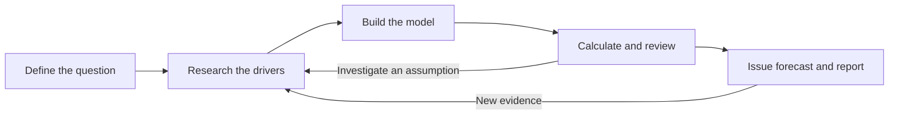
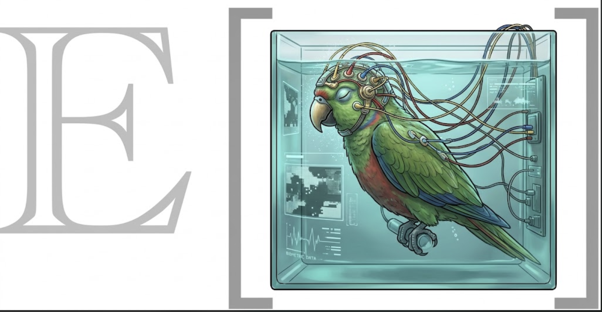

# Vorhersage

**Research a question. Build a probability model. Share a forecast you can inspect.**

[Example report](https://expectedparrot.github.io/vorhersage/examples/nyc-2026-09-16/) ·
[Documentation](https://expectedparrot.github.io/vorhersage/) ·
[Expected Parrot tools](https://expectedparrot.github.io/directory/)

Vorhersage is a forecasting workbench for you and your AI agent. Give the agent a
question—“Will Waymo launch in Boston by 2029?”—and use the package to organize
the research, calculate a probability, and produce a report explaining the answer.

The useful part is being able to follow the reasoning. Which facts support the
forecast? Which numbers are judgment calls? What happens if an approval takes six
months longer? What new evidence would change the prediction? Vorhersage keeps
the sources, model, and forecast history together so you can answer those questions.

The agent searches and makes judgments; the Python package checks the recorded
inputs, computes the declared model, and preserves the work. Its command-line
interface lets an agent resume a study, revise a forecast, or compare methods.

## See it work: will Waymo launch in Boston before 2029?

This is an actual saved study, with research completed on **September 15, 2026**.
It produced a **39% forecast**. Here's how the question became a model and a
number—and how to challenge that number.

The commands below replay the saved research and calculations offline. The JSON
input files are linked beside the steps that use them. To follow along, install
Vorhersage using the [setup block below](#copy-and-paste-into-an-agent) and run
from a checkout of this repository. Models have versioned names such as
`waymo@1`, so the commands can be run as written. `--format text` displays readable
results; the default JSON output provides the complete record for agents.

### 1. Define what counts as a launch

For this question, a launch means **paid rides available to the general public,
with no in-vehicle safety driver, and both pickup and dropoff inside Boston,
before January 1, 2029**. An invitation-only trial or a launch in Cambridge
wouldn't satisfy it. A small service area inside Boston would.

Create a project, load its research checklist, and register that
[question definition](examples/waymo_boston_2029/independent_20260915/question.json):

```bash
CASE="$PWD/examples/waymo_boston_2029/independent_20260915"
vorhersage init ./waymo-demo --name "Waymo in Boston"
cd ./waymo-demo
vorhersage profile add --from "$CASE/walkthrough/profile.json"
vorhersage question add --from "$CASE/question.json"
```

The question is now saved as **version 1**. Subsequent models refer to that exact
wording and deadline.

### 2. Work out what needs researching

Before searching, the forecaster sketched what would have to happen: legal
permission, technical readiness, a fleet ready to operate, local validation,
and public access. The first model left their dates and durations unknown.

Load that [initial structure](examples/waymo_boston_2029/independent_20260915/outputs/structure_before_research.json)
and ask the package what is missing:

```bash
vorhersage timeline add --from "$CASE/outputs/structure_before_research.json" --format text
vorhersage timeline gaps independent_provisional@1 --format text
```

The gaps identify concrete research tasks:

| Unknown input | Research question |
|---|---|
| Legal permission | What state and city permissions are required, and when could they take effect? |
| Technical readiness | How much Boston-specific preparation remains? |
| Fleet readiness | When could vehicles, a depot, and support operations be ready? |
| Local validation | What testing must happen after the prerequisites are met? |
| Public access | How long could it take to move from testing to paid public rides? |

The forecaster supplies the structure; Vorhersage identifies its unresolved
inputs. At this stage, **the model has no probability**. It provides a research
agenda. The [original research questions](examples/waymo_boston_2029/independent_20260915/outputs/research_questions.md)
also ask what can happen in parallel and what could prevent a launch altogether.

### 3. Bring evidence back to the model

The agent researched official legislative records, city proposals, Waymo
statements, and rollout histories in other cities. Here are three findings from
that saved research:

| Finding | How it affects the model |
|---|---|
| The two principal state enabling bills had reached study orders. | Legal permission remained a major source of delay. |
| The restrictive Boston ordinance was recorded as filed, rather than verified enacted. | The model needed to allow several possible local approval paths. |
| Other Waymo launches separated driverless operations, selected riders, and open public access. | Permission or testing alone could not count as a completed launch. |

Each finding retains its source and qualifications in the
[evidence file](examples/waymo_boston_2029/independent_20260915/outputs/evidence.json).
For example, another city's rollout is an imperfect analogue for Boston; it
cannot establish Boston's launch probability by itself.

Import those **17 saved findings**:

```bash
vorhersage packet import --from "$CASE/outputs/evidence.json"
```

The research also changed the model's structure: state and local permission became
separate stages, and some preparation could proceed while permissions were pending.
This is where the agent's interpretation matters.

### 4. Calculate the forecast

The forecaster built eight scenarios, assigned their dates and durations, and
judged how likely each scenario was. The
[completed model](examples/waymo_boston_2029/independent_20260915/walkthrough/model.json)
records those assumptions and their evidence links.

```bash
vorhersage timeline add --from "$CASE/walkthrough/model.json" --format text
vorhersage timeline analyze waymo@1 --format text
```

Vorhersage follows the dependencies, computes a launch date in each scenario,
and sums the probability assigned to scenarios that meet the deadline:

| Scenario | Assigned probability | Launch before 2029? |
|---|---:|:---:|
| Early permission, ordinary rollout | 22% | Yes |
| Early permission, prolonged local delay | 8% | No |
| Permission in the first half of 2028, ordinary rollout | 12% | Yes |
| Late permission, accelerated rollout | 5% | Yes |
| Late permission, ordinary rollout | 5% | No |
| Major technical or operational delay | 5% | No |
| State permission delayed | 40% | No |
| Corporate or national disruption | 3% | No |

**Computed probability: 22% + 12% + 5% = 39%.**

The weights are subjective judgments. The package makes their consequences
inspectable: a scenario with eventual permission can still miss the deadline
because the remaining rollout takes too long.

### 5. Challenge an assumption

Suppose you think the final step to public access will take six months longer.
Create an alternative that adds 180 days to that stage in every scenario,
keeping the other inputs and scenario weights the same:

```bash
vorhersage timeline shift waymo@1 --parameter public_access --days 180 \
  --name slower-access --rationale "Public access takes six months longer" --format text
vorhersage timeline compare waymo@1 slower-access@1 --format text
```

| Model | Probability of launch before 2029 |
|---|---:|
| Original assumptions | **39%** |
| Public access takes 180 additional days | **22%** |

The original model stays unchanged, and `slower-access@1` records its source
and the reason for the change. Two previously successful scenarios now miss the deadline. That tells you why
research into the time from testing to public access could matter. The difference
is a sensitivity check, not a confidence interval.

### 6. Share the model and its alternative

```bash
vorhersage timeline report waymo@1 --compare slower-access@1 --output waymo.html --format text
```

Open **`waymo.html`** to inspect the model, scenario schedules, and comparison.
The [original study's written forecast](examples/waymo_boston_2029/independent_20260915/outputs/forecast_summary.md)
also explains the sources, objections, and observations that would change the
estimate—for example, effective enabling legislation or an actual Boston permit.

This walkthrough reproduces the saved calculation in a fresh project. The
[original issued forecast and validation record](examples/waymo_boston_2029/independent_20260915/README.md)
preserve the full study. Its scenario weights remain open to disagreement;
reproducing 39% verifies the calculation, not its accuracy.

## What you get from a full forecasting run

The agent workflow carries a new question through research, assessment, review,
and an issued prediction. It preserves revisions and schedules follow-up work.



You can export a complete question as HTML or LaTeX. **[Read a finished HTML
report](https://expectedparrot.github.io/vorhersage/examples/nyc-2026-09-16/)**
to see the question, research, methodology, calculations, prediction history,
and limitations together.

That NYC study also demonstrates the market workbench: save a Kalshi quote, keep
it hidden during research, then reveal it after recording your estimate. Research
into local forecast errors moved the estimate from **25.8% to 28.6%**; the opening
market midpoint was **28.0%**. This provides a way to develop a research process
while a question is unresolved. Agreement with a market is distinct from accuracy
against the eventual outcome.

## Design principles and research foundations

The package makes three commitments: **judgments are explicit, calculations are
reproducible, and forecasting skill is measured against outcomes**. The agent
chooses the model and justifies its inputs; the package checks evidence references,
computes consequences, and preserves each issued forecast. Unknown inputs can
remain unknown. Correlated scenarios need joint assumptions rather than automatic
multiplication of independent probabilities.

The forecasting literature informs that design:

| Research | What it motivates in Vorhersage |
|---|---|
| [Halawi et al., *Approaching Human-Level Forecasting with Language Models* (2024)](https://arxiv.org/abs/2402.18563): a system combining retrieval, forecasting, and aggregation. | Keep research and probability assessment explicit; compare methods with the same evidence to investigate where improvements come from. |
| [Karger et al., *ForecastBench* (2025, v5)](https://arxiv.org/abs/2409.19839v5): prospective evaluation on questions unresolved at submission. | Preserve issue times and information cutoffs; distinguish prospective forecasts from historical replay. |
| [Gneiting & Raftery, *Strictly Proper Scoring Rules, Prediction, and Estimation* (2007)](https://sites.stat.washington.edu/people/raftery/Research/PDF/Gneiting2007jasa.pdf): scoring rules that reward honest probability assessments in expectation. | Evaluate probabilities with proper scores such as Brier loss, using explicit resolution rules and matched question sets. |

These are motivations for the design, not evidence that this package improves
accuracy. In particular, the Waymo timeline and its weights are modeling choices
to challenge and test. The [literature review](literature/REVIEW.md) and
[39-source annotated bibliography](literature/BIBLIOGRAPHY.md) record findings,
limitations, reading depth, and proposed experiments. [Learnings](LEARNINGS.md)
records what our own exercises exposed, including contamination in historical
replay and the limits of procedural checklists.

## Try it on your question

Give your agent the question you want to forecast and this setup block. Ask it
to show you the model and the assumptions you should review, alongside the number.

### Copy and paste into an agent

Copy this block into your coding agent along with a forecasting question:

```text
Use Vorhersage to research my forecasting question and produce a sourced HTML
report. If I haven't supplied a question, ask for one.

Install uv if needed: https://docs.astral.sh/uv/getting-started/installation/
Then install Vorhersage and EDSL's ep command together:

uv tool install --python 3.11 --with-executables-from \
  "edsl @ git+https://github.com/expectedparrot/edsl.git@main" \
  "vorhersage @ git+https://github.com/expectedparrot/vorhersage.git@main"
export PATH="$(uv tool dir --bin):$PATH"

Reuse an existing Expected Parrot login; otherwise run this and let me
complete the browser login:

ep auth login

Read the installed guide, then create or resume a project:

vorhersage guide

Follow the guide and CLI schemas to register the question, research it,
record the model and issue a forecast. Use `next` and `submit` to advance
the run. Preserve sources, assumptions and uncertainty. Finish with
`vorhersage report --question QUESTION_ID --output report.html` and show
me the forecast, its main drivers, and the report.
```

This installs from GitHub and requires Git; uv supplies Python 3.11 if needed.
EDSL provides `ep` for Expected Parrot authentication and model execution.
Vorhersage's core workflow, calculations and exports also work locally without
an account. Model and research services are chosen by the agent or configured
workers. For a persistent shell setup, run `uv tool update-shell`.

## Choose a workflow

| Your task | Start here |
|---|---|
| Research and maintain one forecast | [Agent guide](docs/AGENT_GUIDE.md) |
| Pick a live market, research, then compare with its hidden price | [Market workbench](docs/MARKET_WORKBENCH.md) |
| Model a deadline through milestones and dependencies | [Timeline models](docs/TIMELINE_MODELS.md) |
| Declare and audit likelihood-ratio updates | [Odds ledgers and widgets](docs/ODDS_LEDGER.md) |
| Compare methods on the same questions | [Method experiments](docs/EXPERIMENTS.md) |
| Run model/tool workers across related questions | [Live sessions](docs/LIVE_SESSIONS.md) and [joint sessions](docs/JOINT_SESSIONS.md) |
| Produce a readable report and methodology flowchart | [Report exports](docs/REPORTS.md) |
| Reproduce a published forecasting study | [AIRO example](examples/airo/README.md) |

<p align="center">
  
</p>

## Development and design

For a source checkout:

```bash
git clone https://github.com/expectedparrot/vorhersage.git
cd vorhersage
uv venv --python 3.11
uv pip install -e . pytest
.venv/bin/vorhersage guide
.venv/bin/python -m pytest -q
```

The implementation separates responsibilities:

| Code | Responsibility |
|---|---|
| [Timeline calculations](src/vorhersage/timeline.py) | Validate declared dependencies, compute schedules, and compare assumptions. The calculation functions also work without a project database. |
| [Evidence](src/vorhersage/evidence.py) and [store](src/vorhersage/store.py) | Capture provenance and preserve immutable artifacts in transactional SQLite storage. |
| [Workflow](src/vorhersage/workflow.py) | Advance research and review tasks, accept submissions, and issue forecasts. |
| [CLI](src/vorhersage/cli.py) and [terminal views](src/vorhersage/timeline_text.py) | Parse commands and present results; the same domain functions serve JSON and readable output. |

The core package requires Python 3.11+ and has no runtime dependencies.
EDSL and Epiq are optional integrations. The current implementation targets small
portfolios; database migrations and large-scale operation remain future work.

[Learnings](LEARNINGS.md) records what the forecasting exercises taught us,
including contamination in historical replay and the limits of procedural
compliance. See also the [validation record](docs/VALIDATION.md),
[improvement plan](docs/IMPROVEMENT_PLAN.md), [literature review](literature/README.md),
and original [design](DESIGN.md) and [workflow proposal](WORKFLOW.md).
