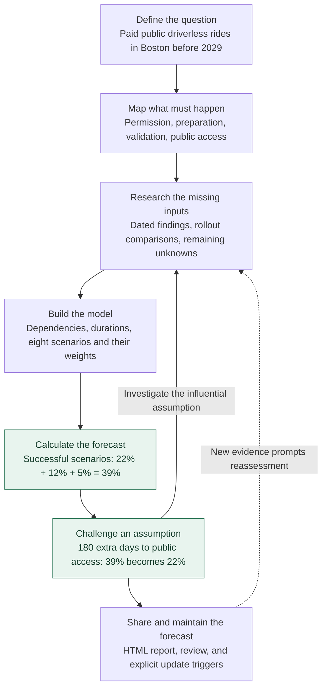
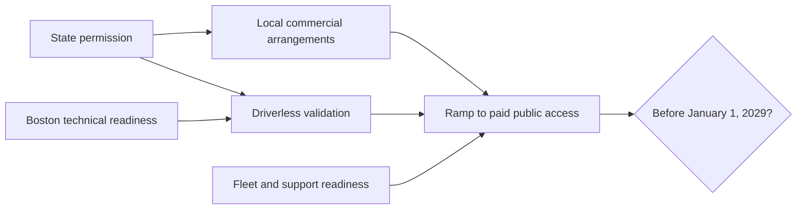

# Vorhersage

**Research a question. Build a probability model. Share a forecast you can inspect.**

[Example report](https://expectedparrot.github.io/vorhersage/examples/nyc-2026-09-16/) ·
[Documentation](https://expectedparrot.github.io/vorhersage/) ·
[Expected Parrot tools](https://expectedparrot.github.io/directory/)

Vorhersage helps you turn a forecasting question into an evidence-backed
probability you can explain and challenge. Define what would count, map what
must happen, collect evidence, and calculate the consequences of your assumptions.
Keep the research, model, and forecast history together, and export a report
someone else can inspect.

You supply the research and judgment, either directly or with an AI agent.
The package checks the recorded inputs, computes the declared model, identifies
missing inputs, and preserves the work. Its tools cover deadline models,
scenario calculations, reference classes, evidence review, and forecast revision.

## Install

```bash
uv tool install "vorhersage @ git+https://github.com/expectedparrot/vorhersage.git@main"
```

Requires [uv](https://docs.astral.sh/uv/getting-started/installation/), Git, and
Python 3.11 or newer. The example below runs locally without an account or model
service. For an agent with Expected Parrot access, use the
[copyable agent setup](#copy-and-paste-into-an-agent).

## See it work: will Waymo launch in Boston before 2029?

Suppose you want to forecast a Boston launch. A useful answer needs to explain
**what must happen, what we know about those steps, and where the uncertainty
comes from**. We'll build up to the **39% estimate** from a saved study, then
challenge an assumption and see it fall to **22%**.

### The forecast at a glance



You decide what the model should represent and justify its inputs. Vorhersage
identifies missing inputs, checks the records, calculates the schedules and
probabilities, and preserves the forecast. Research can change both the numbers
and the model's structure.

The research below was captured on **September 15, 2026, Boston time**. This
walkthrough reproduces that dated study; it does not fetch new evidence. You can
read the whole example here, or run the commands to inspect the model yourself.

**To follow along:** install the package with the command above. We'll build the
initial timeline one step at a time. Later, we'll load the saved research to
reproduce the original forecast.

### 1. Decide what would count

“Launch” could mean a demonstration, an invitation-only trial, or a service
anyone can use. Here we mean **paid rides open to the general public, without an
in-vehicle safety driver, with both pickup and dropoff inside Boston, before
January 1, 2029, Eastern time**. A small service area qualifies; Cambridge-only
service does not.

Record the question and the evidence that will settle it:

```bash
vorhersage init waymo \
  --question "Will Waymo launch public driverless rides in Boston before 2029?" \
  --deadline "2029-01-01T00:00:00-05:00" \
  --yes "Paid rides open to the general public, without an in-vehicle safety driver, with pickup and dropoff inside Boston before the deadline." \
  --source "Waymo service announcements, access terms, and corroborating local reporting"
```

Your work is saved in the `waymo` folder. The later commands use `--project waymo`
to open that folder. The definition gives the research a concrete target: testing
vehicles on Boston streets is progress, but does not yet satisfy the question.

### 2. Turn the question into something we can research

A **timeline** describes the steps needed for a launch and which steps must wait
for others. Start an empty plan for the question we just saved:

```bash
vorhersage timeline new waymo-plan.toml --project waymo
```

`waymo-plan.toml` is your editable working file. It takes the question and deadline
from the `waymo` folder. No dates, durations, or probabilities have been assigned.

First, add legal permission. This is a milestone whose **date** we need to research:

```bash
vorhersage timeline step waymo-plan.toml legal "Permission for paid driverless service" --date
```

Add technical preparation and fleet readiness. Their unknown inputs are
**durations**. We haven't made either wait for legal permission, so they can
proceed in parallel:

```bash
vorhersage timeline step waymo-plan.toml technical "Boston technical readiness"
vorhersage timeline step waymo-plan.toml fleet "Fleet, depot, and support readiness"
```

Driverless validation must wait for **both** legal permission and technical
readiness. `--after` expresses that dependency:

```bash
vorhersage timeline step waymo-plan.toml validation "Local driverless validation" \
  --after legal technical
```

Finally, public access must wait for validation and fleet readiness. `--target`
marks the step whose completion would satisfy our forecasting question:

```bash
vorhersage timeline step waymo-plan.toml launch "Paid rides open to the general public" \
  --after validation fleet --target
```

Read the plan you've built:

```bash
vorhersage timeline show waymo-plan.toml
```

Each step is shown with its prerequisites and unknown input. For example:

```text
validation — Local driverless validation
  Waits for: legal, technical
  Unknown: duration in elapsed days
  Reason: Provisional dependency; verify during research.

launch — Paid rides open to the general public
  Waits for: validation, fleet
  Unknown: duration in elapsed days
  Reason: Provisional dependency; verify during research.
```

You can also open `waymo-plan.toml` in a text editor. The validation step looks like
this; `after` lists the prerequisites, and `rationale` records why they apply:

```toml
[[steps]]
id = "validation"
description = "Local driverless validation"
kind = "duration"
after = ["legal", "technical"]
rationale = "Provisional dependency; verify during research."
```

The commands above reconstruct the original study's initial dependency structure
as one unresolved research plan. We have not assigned the original study's later
scenario timings or weights. Save this structure after checking its dependencies:

```bash
vorhersage timeline save waymo-plan.toml --project waymo
```

Saving checks for cycles and disconnected steps, then keeps an immutable copy.
The `.toml` file remains editable. You can ask for its research gaps directly:

```bash
vorhersage timeline gaps waymo-plan.toml
```

The output begins with `Unresolved parameters: 5`. In ordinary language, these
missing dates and durations give us the following research agenda:

| Missing input | What we need to investigate |
|---|---|
| Legal permission | Which Massachusetts and Boston permissions are required? What could make them take effect? |
| Technical readiness | How much Boston-specific preparation remains? Does winter prevent all service or restrict it? |
| Fleet readiness | What is known about vehicles, a depot, staffing, and support? |
| Local validation | What testing and restricted passenger operation must happen after prerequisites are met? |
| Public access | How long might the transition from restricted rides to paid, open access take? |

**There is still no probability.** The model has given us specific unknowns to
investigate. Vorhersage finds missing inputs in the structure we supplied; the
forecaster remains responsible for whether that structure captures the real process.

### 3. Collect evidence—and let it change the model

The saved research examined official legislative records, city proposals, Waymo
statements, and rollout histories in other cities. Each finding separates what a
source establishes from what we infer:

| Finding in the saved research | Implication for this forecast | What remains uncertain |
|---|---|---|
| Both principal Massachusetts enabling bills had reached study orders. | A legal route could take substantial time. | These records do not give a probability of future enactment or rule out every alternative route. |
| Boston's restrictive ordinance was recorded as filed, not verified enacted. | State permission and final local arrangements need separate treatment. | Future state preemption and Boston's eventual requirements were unknown. |
| Miami took 148 days from driverless operations to open access; Orlando took 50 days from selected riders to open access. | Driverless operation and general-public access are distinct stages. | These are different starting points and a few related examples, not a representative sample of Boston launch times. |
| No Boston depot completion date was verified. | Fleet readiness remains an explicit model input. | Missing public evidence does not establish that no preparation is happening. |

To continue with the saved study, [download the research files](docs/assets/waymo-inputs.zip)
and extract `waymo-inputs` into your working directory. `evidence.json` contains
17 findings with their sources and dates; `model.json` contains the researched
scenarios and assumptions. The archive also includes the original JSON draft for
reference. Import the findings:

```bash
vorhersage --project waymo packet import --from waymo-inputs/evidence.json
```

A **packet** is a saved collection of evidence. Model inputs can cite its individual
findings. Vorhersage checks that those references exist and meet the model's
information cutoff; attaching a citation does not establish that an estimate is correct.
See the [saved findings and sources](examples/waymo_boston_2029/independent_20260915/outputs/forecast_summary.md#source-packet).

The research prompted a structural change: split the original legal gate into
**state permission** and **local commercial arrangements**. The resulting model is:



An arrow means “must finish before the next step starts.” Multiple incoming arrows
mean all prerequisites must finish. Fleet and technical preparation can proceed
while permission is pending. In this model, local commercial arrangements can
also overlap driverless validation. **That overlap is an assumption to examine**:
if local permission is needed before any driverless testing, the graph must change.

### 4. Make the uncertain numbers explicit

Evidence narrows the possibilities; it rarely supplies an exact duration or
probability. The completed model therefore describes eight possible futures,
each with its own set of dates and durations, rationale, and probability weight.

Here are the inputs for just one: **early permission, ordinary rollout**.

| Input | Value in this scenario | Basis recorded in the model |
|---|---:|---|
| Effective state permission | June 1, 2027 | Assumed date; no empirical legislative timing model was available. |
| Remaining technical preparation | 270 days from the research cutoff | Evidence-informed estimate using Boston activity and Denver's rollout; Boston readiness was unobserved. |
| Remaining fleet preparation | 300 days from the cutoff | Assumed duration; financing supports feasibility but supplies no Boston schedule. |
| Local commercial arrangements | 120 days after state permission | Assumed duration for an uncertain future process. |
| Driverless validation | 90 days after state and technical readiness | Estimate informed by deployment stages in other cities. |
| Final public-access ramp | 90 days after all prerequisites | Estimate informed by staged openings; not a measured Boston duration. |

These entries are stored in `model.json`, alongside the evidence references and
explanations. **Observed, estimated, assumed, and unresolved inputs are distinct.**
For work already underway, the model counts remaining time at the research cutoff.

The saved researched model is named `waymo`, version 1. In the commands below,
`waymo@1` selects that exact version and `--format text` requests readable output.
Save it and calculate its schedules:

```bash
vorhersage --project waymo timeline add --from waymo-inputs/model.json --format text
vorhersage --project waymo timeline analyze waymo@1 --format text
```

For the early-permission scenario, the package computes:

| Milestone | Computed completion (UTC date) |
|---|---|
| State permission | June 1, 2027 |
| Technical preparation | June 13, 2027 |
| Fleet preparation | July 13, 2027 |
| Driverless validation | September 11, 2027 |
| Local commercial arrangements | September 29, 2027 |
| Paid public access | December 28, 2027 |

Local arrangements finish last among the three prerequisites for public access.
The final 90-day ramp therefore starts on September 29. Adding all the durations
in sequence would give a different answer because it would count parallel work
as sequential. The displayed dates are consequences of the assumptions, not
claims that we can predict an opening day precisely.

### 5. See where the 39% comes from

The analysis prints `Probability: 39.0%` and a row for each scenario. Here is the
same calculation with descriptive labels:

| Scenario | Assigned probability | Computed launch (UTC date) | Before the deadline? |
|---|---:|---|:---:|
| Early permission, ordinary rollout | 22% | December 28, 2027 | Yes |
| Early permission, prolonged local delay | 8% | April 21, 2029 | No |
| Permission in the first half of 2028, ordinary rollout | 12% | September 28, 2028 | Yes |
| Late permission, accelerated rollout | 5% | October 30, 2028 | Yes |
| Late permission, ordinary rollout | 5% | May 13, 2029 | No |
| Major technical or operational delay | 5% | November 9, 2029 | No |
| State permission delayed | 40% | January 27, 2030 | No |
| Corporate or national disruption | 3% | No launch in this scenario | No |

**Probability of qualifying launch = 22% + 12% + 5% = 39%.**

The forecaster assigns the weights; Vorhersage calculates which scenarios meet
the deadline and adds their weights. It checks that weights sum to 100% and
requires an explanation of how the scenarios cover distinct possible outcomes.
It cannot establish that the chosen weights are well calibrated.

Each row describes a whole possible future, keeping related political and
operational delays together. We do not multiply independent probabilities of
permission, readiness, and access. One consequential judgment is the **40% weight
on state delay**. Another is the coarse grouping of late legislative outcomes,
which may understate the possibility of a very fast late-2028 launch.

### 6. Challenge the forecast with a specific disagreement

Suppose you think public access will take six months longer than the model allows.
You can change that assumption without editing the full model:

```bash
vorhersage --project waymo timeline shift waymo@1 --parameter public_access --days 180 \
  --name slower-access --rationale "Public access takes six months longer" --format text
vorhersage --project waymo timeline compare waymo@1 slower-access@1 --format text
```

`public_access` names the final stage in the model. The command adds 180 elapsed
days to it in every finite scenario, retaining the weights and other inputs.
It saves the alternative as `slower-access@1`, with its reason and a link to the
original model.

The comparison reports:

```text
Left probability:  39.0%
Right probability: 22.0%
```

The 12% mid-2028 scenario and 5% accelerated late-2028 scenario now miss the
deadline. Only the 22% early-launch scenario still succeeds. **The disagreement
has become a checkable claim about a particular stage.**

That suggests a useful next research question: what governs the time from
restricted rides to unrestricted access, and how comparable are the other cities?
The result measures sensitivity to this assumption; it does not establish how
much more research will improve accuracy.

The [original study](examples/waymo_boston_2029/independent_20260915/outputs/forecast_summary.md#sensitivity-and-structural-uncertainty)
also tested political weights and the dependency structure. Moving 15 percentage
points between early success and state delay produced **24%–54%**. Making local
permission a prerequisite for validation left the weighted result at **39%**
under those particular timings. These are assumption checks, not confidence intervals.

### 7. Open a report you can interrogate

```bash
vorhersage --project waymo timeline report waymo@1 --compare slower-access@1 --output waymo.html --format text
```

Open **`waymo.html`** in your browser. It works offline. Select a scenario to see
the original and alternative schedules side by side, which milestones determine
the dates, and which outcomes cross the deadline. The report also includes the
exact question, evidence, and recorded assumptions.

Try selecting `mid2028_normal`: the original launch meets the deadline; the
180-day delay moves it past the deadline. You can now explain both the 39% and
the 22% forecast by pointing to the work required and the assumptions that changed.

### 8. Decide what would warrant a revision

A forecast also needs a stopping reason and a plan for reconsideration. In the
original study, the review retained 39%, while acknowledging that further public
searches had not identified legislative probabilities or internal Boston schedules.
The review challenged the number in both directions:

- **Too high?** Stalled bills, local opposition, and unproven winter performance
  could delay launch. The model includes delay scenarios, but their weights remain judgments.
- **Too low?** A small service area, a pilot framework, or rapid political
  accommodation could enable a faster launch. The coarse late-permission scenarios
  may miss that possibility.

It then recorded these kinds of update triggers:

| New observation | What to revisit |
|---|---|
| Effective enabling legislation or a legally authorized paid-driverless pilot | State permission, local authority, and the weight on political delay. |
| A Boston permit, depot opening, or actual driverless passenger phase | The relevant remaining durations and prerequisites. |
| A public launch announcement | Whether access, fares, driverlessness, and Boston boundaries satisfy the question. |
| Withdrawal or a major safety suspension | Delay and disruption scenarios. |

The full workflow records research, review, the issued estimate, and its update
triggers. A later forecast preserves the earlier one and records the revision.
New evidence requires reassessment; the package does not invent an automatic
probability update from the mere passage of time.

The commands above reproduce the model and its sensitivity comparison. The
[original issued forecast and validation record](examples/waymo_boston_2029/independent_20260915/README.md)
contain the completed research-and-review history. Reproducing the calculation
checks the arithmetic; eventual resolution is needed to score the forecast.

## What you get from a full forecasting run

The same research-and-review workflow can be driven by a person or an agent.
It carries a question through assessment, review, and an issued prediction,
preserves revisions, and schedules follow-up work.

You can export a complete question as HTML or LaTeX. **[Read a finished HTML
report](https://expectedparrot.github.io/vorhersage/examples/nyc-2026-09-16/)**
to see the question, research, methodology, calculations, prediction history,
and limitations together.

That NYC study also demonstrates the market workbench: save a Kalshi quote, keep
it hidden during research, then reveal it after recording your estimate. Research
into local forecast errors moved the estimate from **25.8% to 28.6%**; the opening
market midpoint was **28.0%**. This provides a way to develop a research process
while a question is unresolved. Agreement with a market is distinct from accuracy
against the eventual outcome.

## Design principles and research foundations

The package makes three commitments: **judgments are explicit, calculations are
reproducible, and forecasting skill is measured against outcomes**. The forecaster
chooses the model and justifies its inputs; the package checks evidence references,
computes consequences, and preserves each issued forecast. Unknown inputs can
remain unknown. Correlated scenarios need joint assumptions rather than automatic
multiplication of independent probabilities.

The forecasting literature informs that design:

| Research | What it motivates in Vorhersage |
|---|---|
| [Halawi et al., *Approaching Human-Level Forecasting with Language Models* (2024)](https://arxiv.org/abs/2402.18563): a system combining retrieval, forecasting, and aggregation. | Keep research and probability assessment explicit; compare methods with the same evidence to investigate where improvements come from. |
| [Karger et al., *ForecastBench* (2025, v5)](https://arxiv.org/abs/2409.19839v5): prospective evaluation on questions unresolved at submission. | Preserve issue times and information cutoffs; distinguish prospective forecasts from historical replay. |
| [Gneiting & Raftery, *Strictly Proper Scoring Rules, Prediction, and Estimation* (2007)](https://sites.stat.washington.edu/people/raftery/Research/PDF/Gneiting2007jasa.pdf): scoring rules that reward honest probability assessments in expectation. | Evaluate probabilities with proper scores such as Brier loss, using explicit resolution rules and matched question sets. |

These are motivations for the design, not evidence that this package improves
accuracy. In particular, the Waymo timeline and its weights are modeling choices
to challenge and test. The [literature review](literature/REVIEW.md) and
[39-source annotated bibliography](literature/BIBLIOGRAPHY.md) record findings,
limitations, reading depth, and proposed experiments. [Learnings](LEARNINGS.md)
records what our own exercises exposed, including contamination in historical
replay and the limits of procedural checklists.

## Try it on your question

Start with the question itself:

```bash
vorhersage start "Will our app launch before January 1, 2030?" --project launch
```

The CLI asks you to define what counts, the deadline, and the sources that will
settle the outcome. Supply them with `define`, or include `--deadline`, `--yes`,
and `--source` in the initial `start` command. Once defined, the research workflow
begins automatically.

Use `vorhersage show --project launch` to read progress and
`vorhersage next --project launch --output task.json` to get the next task and
answer template. You can fill the task file yourself or work with an agent.
`vorhersage report --project launch` exports the recorded work as HTML.
The [single-question guide](docs/SINGLE_QUESTION.md) walks through an answer,
submission, review, and report export.

For an agent with Expected Parrot access, copy the setup below and ask it to
show you the model and the assumptions you should review, alongside the number.

### Copy and paste into an agent

Copy this block into your coding agent along with a forecasting question:

```text
Use Vorhersage to research my forecasting question and produce a sourced HTML
report. If I haven't supplied a question, ask for one.

Install uv if needed: https://docs.astral.sh/uv/getting-started/installation/
Then install Vorhersage and EDSL's ep command together:

uv tool install --python 3.11 --with-executables-from \
  "edsl @ git+https://github.com/expectedparrot/edsl.git@main" \
  "vorhersage @ git+https://github.com/expectedparrot/vorhersage.git@main"
export PATH="$(uv tool dir --bin):$PATH"

Reuse an existing Expected Parrot login; otherwise run this and let me
complete the browser login:

ep auth login

Read the installed guide, then create or resume a project:

vorhersage guide

For a new single-question study, use `start` and supply the agreed event
definition. Set --forecaster to your agent name. Use `next --output` and
`submit --from` to advance the research and review tasks. Preserve sources,
assumptions and uncertainty. Finish with `report --project STUDY_FOLDER`
and show me the forecast, its main drivers, and the report. For an existing
portfolio, follow the guide's explicit question and run commands.
```

This installs from GitHub and requires Git; uv supplies Python 3.11 if needed.
EDSL provides `ep` for Expected Parrot authentication and model execution.
Vorhersage's core workflow, calculations and exports also work locally without
an account. Model and research services are chosen by the agent or configured
workers. For a persistent shell setup, run `uv tool update-shell`.

## Choose a workflow

| Your task | Start here |
|---|---|
| Work on one forecast yourself or with an agent | [Single-question guide](docs/SINGLE_QUESTION.md) |
| Manage a portfolio and its forecast revisions | [Agent guide](docs/AGENT_GUIDE.md) |
| Pick a live market, research, then compare with its hidden price | [Market workbench](docs/MARKET_WORKBENCH.md) |
| Model a deadline through milestones and dependencies | [Timeline models](docs/TIMELINE_MODELS.md) |
| Declare and audit likelihood-ratio updates | [Odds ledgers and widgets](docs/ODDS_LEDGER.md) |
| Reuse evidence and reference cases; check related forecasts for consistency | [Research and monitoring](docs/RESEARCH_AND_MONITORING.md) |
| Compare methods on the same questions | [Method experiments](docs/EXPERIMENTS.md) |
| Score forecasts after resolution | [Evaluation guide](docs/AGENT_GUIDE.md#resolve-and-compare) |
| Run model/tool workers across related questions | [Live sessions](docs/LIVE_SESSIONS.md) and [joint sessions](docs/JOINT_SESSIONS.md) |
| Produce a readable report and methodology flowchart | [Report exports](docs/REPORTS.md) |
| Reproduce a published forecasting study | [AIRO example](examples/airo/README.md) |

<p align="center">
  
</p>

## Development and design

For a source checkout:

```bash
git clone https://github.com/expectedparrot/vorhersage.git
cd vorhersage
uv venv --python 3.11
uv pip install -e . pytest
.venv/bin/vorhersage guide
.venv/bin/python -m pytest -q
```

The implementation separates responsibilities:

| Code | Responsibility |
|---|---|
| [Timeline calculations](src/vorhersage/timeline.py) | Validate declared dependencies, compute schedules, and compare assumptions. The calculation functions also work without a project database. |
| [Evidence](src/vorhersage/evidence.py) and [store](src/vorhersage/store.py) | Capture provenance and preserve immutable artifacts in transactional SQLite storage. |
| [Workflow](src/vorhersage/workflow.py) | Advance research and review tasks, accept submissions, and issue forecasts. |
| [CLI](src/vorhersage/cli.py) and [terminal views](src/vorhersage/timeline_text.py) | Parse commands and present results; the same domain functions serve JSON and readable output. |

The core package requires Python 3.11+ and has no runtime dependencies.
EDSL and Epiq are optional integrations. The current implementation targets small
portfolios; database migrations and large-scale operation remain future work.

[Learnings](LEARNINGS.md) records what the forecasting exercises taught us,
including contamination in historical replay and the limits of procedural
compliance. See also the [validation record](docs/VALIDATION.md),
[improvement plan](docs/IMPROVEMENT_PLAN.md), [literature review](literature/README.md),
and original [design](DESIGN.md) and [workflow proposal](WORKFLOW.md).
