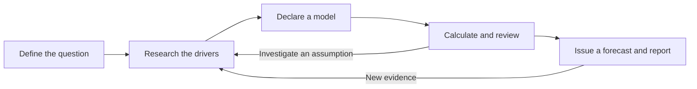

# Vorhersage

**Make forecasts you can explain, challenge, and update.**

[Read a complete forecast](https://expectedparrot.github.io/vorhersage/examples/nyc-2026-09-16/) ·
[Documentation](https://expectedparrot.github.io/vorhersage/) ·
[Expected Parrot tools](https://expectedparrot.github.io/directory/)

Will a product ship on time? Will Waymo launch in Boston by 2029? How likely is
a team to win a championship?

Vorhersage helps you turn questions like these into **a probability with a case
behind it**: what you found, which assumptions you made, how the calculation
works, and what would change your mind. You can read the result as a report,
challenge an influential assumption, and return later to update the forecast
without losing its history.

It is a Python package and command-line tool, designed to work with an AI agent.
You bring the question; the agent researches it and proposes a model. Vorhersage
organizes the work, checks the required inputs, performs the declared calculations,
and saves the evidence and predictions. You can also supply your own research and
judgments through the CLI.

## A forecast, from question to answer

Imagine your team is about to release an app. Someone asks:

> **“Will we launch next week?”**

Here is a small, fictional example of the work you would do with Vorhersage.
The probabilities below are invented for the example; real research would need
to justify them.

### Make the question answerable

“Launch” could mean an internal demo, an invitation-only beta, or public access.
We choose **QA passed and at least one external user able to access the public
release within seven days**. The project records an exact deadline and the
release log that will settle the question.

That definition matters: a working build alone won't count as a public launch.

### Identify what has to happen, then research it

For this release, public access requires QA to pass, followed by approval and
deployment. We ask about both stages:

| What we need to know | What the fictional briefing tells us | Judgment used in the model |
|---|---|---|
| Will QA pass in time? | The last checks are scheduled, but defect severity is unknown. | 90% chance of passing by the deadline. |
| If QA passes, will approval and deployment finish in time? | Both still need to happen; late QA leaves less time. | 80% chance of public access by the same deadline, **given QA passes**. |

Vorhersage keeps the briefing alongside the judgments it supports. A reviewer
can distinguish “the checks are scheduled” from “we assign a 90% chance.”

### Turn those judgments into a probability

The agent declares the two stages and their relationship. Vorhersage calculates:

```text
Chance of launching in time
  = chance QA passes in time
    × chance of launching in time given QA passes

  = 90% × 80%
  = 72%
```

The second number already accounts for how much time QA leaves for deployment.
We are making a conditional estimate, not assuming the stages are independent.

### Find the assumption worth investigating

The useful discussion is now specific: **is 80% too optimistic about the time
left after QA?** We can work through alternatives before deciding what to research:

| Assumption about launch after QA | Resulting launch probability |
|---|---:|
| Approval is slow: only a 60% conditional chance | 90% × 60% = **54%** |
| Original estimate: an 80% conditional chance | 90% × 80% = **72%** |
| Approval is prepared in advance: a 95% conditional chance | 90% × 95% = **85.5%** |

These are illustrative what-if calculations, not a confidence interval or three
issued forecasts. They point to a useful next question for the release team:
can approval happen during QA, and how long does deployment actually take?

The workflow includes a review of why the estimate might be too high **and** too
low. For this example, we retain the original assumptions and issue the forecast.
In a real study, the review can send the agent back for more research.

### Get a forecast you can use and revisit

The result, in plain English:

> **72% probability of public launch within seven days.**
>
> **Why:** QA has a 90% chance of passing in time; conditional on that, approval
> and deployment have an 80% chance of meeting the same deadline.
>
> **Main uncertainty:** QA could finish so late that the 80% estimate is too high.
> Preparing approval in advance could instead make it too low.
>
> **Next review:** Tomorrow, or when QA results or the release schedule change.

The project preserves the source, model, review, and issued prediction. Its HTML
report brings those together for a reader; LaTeX and JSON exports are also
available. When new evidence arrives, you can record a revised forecast and keep
the original for comparison.

This is what the package adds to a forecasting conversation: a question with
clear rules, an inspectable model, a record of the research, and a prediction
you can come back to. The quality of the evidence and judgment still matters;
correct arithmetic alone cannot establish that 72% is a good forecast.

<details>
<summary><strong>Run this example yourself</strong> — offline, no account or model calls</summary>

After installing Vorhersage below, run this from a source checkout:

```bash
python3 examples/quickstart.py ./launch-demo
```

The [script](examples/quickstart.py) supplies the fictional briefing and judgments
through the public CLI. Vorhersage computes the 72% assessment and saves the
project. Choose a new output directory, then open **`launch-demo/report.html`**.
You can also inspect and export it yourself:

```bash
vorhersage --project ./launch-demo status
vorhersage --project ./launch-demo report --question app-launch --output ./launch-demo/report.html
```

The project includes the authored inputs in `inputs/`, task requests in `tasks/`,
CLI responses in `receipts/`, and a `report.json` export. This script reproduces
the original 72% forecast; the what-if alternatives above are explanatory.

</details>

## What this looks like on real questions

### Will Waymo launch public driverless service in Boston before 2029?

The [saved Waymo study](examples/waymo_boston_2029/independent_20260915/README.md)
uses a timeline model: state permission, local approvals, technical preparation,
driverless validation, and public access. Some work can overlap; some has to wait.
The package computes whether each proposed scenario reaches public access before
the deadline.

The September 15, 2026 forecast assigned these probabilities to successful scenarios:

| Scenario that meets the deadline | Assigned probability |
|---|---:|
| Early state permission, ordinary rollout | 22% |
| Permission in the first half of 2028, ordinary rollout | 12% |
| Permission in the third quarter of 2028, accelerated rollout | 5% |
| **Total probability of launch by the deadline** | **39%** |

The other scenarios account for the remaining 61%. The weights are the forecaster's
judgments; the package computes the schedules and adds the weights of scenarios
that qualify. Moving 15 percentage points between early success and state delay
changes the answer to **24% or 54%**. Adding 180 days to the final public-access
stage lowers it to **22%**.

That makes disagreement actionable: a reviewer can challenge the timing of
permission, a rollout duration, or a scenario's weight. See the
[full explanation, sources, and assumptions](examples/waymo_boston_2029/independent_20260915/outputs/forecast_summary.md).
This is a dated forecast, not a claim that the probability has been validated.

### Does additional research move a forecast closer to a market?

The [NYC temperature study](https://expectedparrot.github.io/vorhersage/examples/nyc-2026-09-16/)
asked whether the reported high would be 79–80°F. It saved a Kalshi quote, kept
that price hidden during research, and recorded successive estimates:

| Research completed | Forecast |
|---|---:|
| Weather forecast plus an assumed error distribution | 25.8% |
| Morning observations and forecast discussion | 25.8% |
| A sample of 31 local forecast errors | 28.6% |
| **Opening Kalshi midpoint, revealed after sealing the research** | **28.0%** |

The report shows what changed the number, what didn't, and which assumptions
remain debatable. Agreement with a market gives a development target before
resolution; it does not establish accuracy. This one case also had limited market
depth and a small historical sample.

**[Read the complete HTML report](https://expectedparrot.github.io/vorhersage/examples/nyc-2026-09-16/)**
· [Download the PDF](https://expectedparrot.github.io/vorhersage/examples/nyc-2026-09-16/full-report.pdf)
· [Inspect the research and calculation](examples/market_workbench/nyc_20260916/README.md)

## How the package works



An agent does the searching, interprets sources, and justifies the assumptions.
Vorhersage gives that work a persistent structure:

- **Evidence attached to claims.** Keep sources, findings, uncertainties, and the
  information cutoff with the forecast.
- **Models you can inspect.** Use historical frequencies, conditional paths like
  the app example, weighted scenarios, deadline models, or declared odds updates.
  Timeline and odds-ledger tools support sensitivity analysis; odds ledgers can
  also be exported as interactive HTML audits.
- **A research process you can improve.** Compare methods on the same questions,
  reuse frozen evidence, or research against a hidden market quote.
- **A history you can evaluate.** Resume work, schedule reviews, preserve revisions,
  and score predictions once outcomes are known.

At the CLI, the agent asks for the next task with `next`, does the work, and sends
it back with `submit`. Each task includes its input schema and the saved context.
Another agent can pick up the project without reconstructing a chat. The guides
below provide complete paths for different kinds of forecast.

## Try it on your question

The quickest way to start is to give an agent a question and the setup block below.
Ask for a report you can read, then use its assumptions to guide your review.

### Copy and paste into an agent

Copy this block into your coding agent along with a forecasting question:

```text
Use Vorhersage to research my forecasting question and produce a sourced HTML
report. If I haven't supplied a question, ask for one.

Install uv if needed: https://docs.astral.sh/uv/getting-started/installation/
Then install Vorhersage and EDSL's ep command together:

uv tool install --python 3.11 --with-executables-from \
  "edsl @ git+https://github.com/expectedparrot/edsl.git@main" \
  "vorhersage @ git+https://github.com/expectedparrot/vorhersage.git@main"
export PATH="$(uv tool dir --bin):$PATH"

Reuse an existing Expected Parrot login; otherwise run this and let me
complete the browser login:

ep auth login

Read the installed guide, then create or resume a project:

vorhersage guide

Follow the guide and CLI schemas to register the question, research it,
record the model and issue a forecast. Use `next` and `submit` to advance
the run. Preserve sources, assumptions and uncertainty. Finish with
`vorhersage report --question QUESTION_ID --output report.html` and show
me the forecast, its main drivers, and the report.
```

This installs from GitHub and requires Git; uv supplies Python 3.11 if needed.
EDSL provides `ep` for Expected Parrot authentication and model execution.
Vorhersage's core workflow, calculations and exports also work locally without
an account. Model and research services are chosen by the agent or configured
workers. For a persistent shell setup, run `uv tool update-shell`.

## Choose a workflow

| Your task | Start here |
|---|---|
| Research and maintain one forecast | [Agent guide](docs/AGENT_GUIDE.md) |
| Pick a live market, research, then compare with its hidden price | [Market workbench](docs/MARKET_WORKBENCH.md) |
| Model a deadline through milestones and dependencies | [Timeline models](docs/TIMELINE_MODELS.md) |
| Declare and audit likelihood-ratio updates | [Odds ledgers and widgets](docs/ODDS_LEDGER.md) |
| Compare methods on the same questions | [Method experiments](docs/EXPERIMENTS.md) |
| Run model/tool workers across related questions | [Live sessions](docs/LIVE_SESSIONS.md) and [joint sessions](docs/JOINT_SESSIONS.md) |
| Produce a readable report and methodology flowchart | [Report exports](docs/REPORTS.md) |
| Reproduce a published forecasting study | [AIRO example](examples/airo/README.md) |

<p align="center">
  
</p>

## Development and design

For a source checkout:

```bash
git clone https://github.com/expectedparrot/vorhersage.git
cd vorhersage
uv venv --python 3.11
uv pip install -e . pytest
.venv/bin/vorhersage guide
.venv/bin/python -m pytest -q
```

The core package requires Python 3.11+ and has no runtime dependencies.
EDSL and Epiq are optional integrations. The current implementation targets small
portfolios; database migrations and large-scale operation remain future work.

[Learnings](LEARNINGS.md) records what the forecasting exercises taught us,
including contamination in historical replay and the limits of procedural
compliance. See also the [validation record](docs/VALIDATION.md),
[improvement plan](docs/IMPROVEMENT_PLAN.md), [literature review](literature/README.md),
and original [design](DESIGN.md) and [workflow proposal](WORKFLOW.md).
