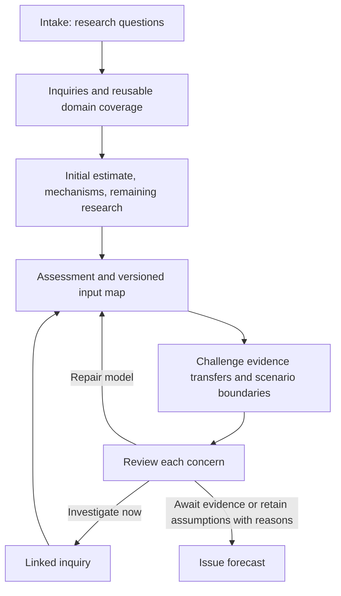

# Check the model, then repair it

New single-question studies use `structured_v2`. Older studies keep their saved
contract. The package computes and checks declared structures; the forecaster
still decides whether a claim is credible and whether it supports an estimate.



Timeline studies substitute structure and parameter research for the initial
estimate and domain tasks. Their repair passes revisit structure and parameters.

## Map research to the quantities you actually estimate

Every assessment contains `parameter_support` and `model_map`. These are two
views of the same inputs: the first describes support and ranges; the second
versions the mapping from research questions to model quantities. Each map row
contains `model_input`, intake `input_ids`, `target`, and `quantity`.

Use version 1 / previous_version 0 initially. Later passes increment the map
version from `context.model_map`; explain the change or retained mapping in
`rationale`. Task artifacts preserve every map. A revision of an issued forecast
continues the previous map's numbering.

| Quantity | Example path |
|---|---|
| `probability` | `probability` or `anchor/probability` |
| `scenario_weight` | `scenarios/high_prices/weight` |
| `conditional_probability` | `scenarios/high_prices/probability` or `components/target/probability` |
| `likelihood_ratio` | `entries/finding/lr` |
| `ensemble_weight` | `members/FORECAST_ID/weight` |
| `timeline_input` | `scenarios/fast/inputs/permission_date` |

A scenario weight asks “How likely is this future?” Its conditional probability
asks “How likely is the target event within this future?” Evidence about political
opposition may inform the second without informing the first. Switching from
political-pathway scenarios to price scenarios requires reconsidering those links.
Mapping the right type is mechanically checked; mapping the right meaning needs
review. One research input may inform several model inputs, and a map row may
link several research inputs. Do not force a one-to-one pairing.

## Keep findings small enough to inspect

Capture one claim and its supporting passage:

```bash
vorhersage evidence add "The owner reports QA is complete." --project launch \
  --url "urn:interview:owner" --title "Owner answer" \
  --excerpt "QA is complete; signup work remains." --claim-type observation

vorhersage evidence add "QA is no longer the remaining launch bottleneck." --project launch \
  --url "urn:interview:owner" --title "Owner answer" \
  --excerpt "QA is complete; signup work remains." --claim-type inference \
  --inference-rationale "Assume no QA reopening; the reported remaining work is signup."
```

`evidence add` links the supplied passage to the claim. It does not fetch the URL
or check entailment. `research capture` bundles can give each finding its own
`claim_support` list with `source_id`, `passage`, `relation` (`direct` or
`inference`), and `rationale`. Inference findings also declare
`inference_rationale`. Each passage must occur in the supplied source excerpt or
captured content. Existing packets without these links remain readable and their
audits identify the missing claim support.

Avoid findings that combine inventories, prices, legal authority, and policy
statements under one citation. A source about compelling production after a ban
does not necessarily establish authority to impose the ban.

## Inspect each evidence transfer

After submitting an assessment:

```bash
vorhersage next --project launch --output challenge-task.json
vorhersage schema model_challenge
```

For a one-input judgment model, an illustrative `challenge-answer.json` is:

```json
{
  "map_version": 1,
  "transfers": [{
    "model_input": "probability",
    "verdict": "assumption",
    "reason": "The owner reports readiness, not a measured launch frequency.",
    "evidence_refs": []
  }],
  "boundary_cases": [],
  "partition_review": "Direct judgment has no scenario partition.",
  "concerns": [{
    "id": "remaining_work",
    "model_inputs": ["probability"],
    "question": "How much signup work remains?",
    "disposition": "investigate",
    "rationale": "The estimate assumes that remaining work is short.",
    "action": "Inspect the current signup task list and its owners' estimates."
  }]
}
```

```bash
vorhersage submit --project launch --task challenge-task.json --answer challenge-answer.json
vorhersage next --project launch --output review-task.json
```

Every actual input needs a transfer verdict: `supported`, `assumption`, or
`mismatch`, with a reason and evidence references. An assumed input cannot be
marked supported. A mismatch needs a linked concern. Inspect the most influential
inputs first using `context.sensitivity`, then complete the other inputs.

For scenario models, provide at least two concrete `boundary_cases`, each with
`description`, `scenario_ids`, and `reason`. Include an intermediate state and a
reversal before the deadline. For example: prices spike, a restriction is enacted,
then prices fall. Does that trajectory belong to exactly one scenario, and does
the scenario's conditional event definition still make sense?

Record zero or multiple matches honestly and link them to named `concern_ids`. The package rejects unknown scenario
IDs and requires a concern for uncovered or overlapping cases. It does not
classify narratives automatically or prove that the partition is exhaustive.

## Give every concern a disposition

Alongside the usual objections and `sensitivity_review`, the review includes:

```json
{
  "decision": "research",
  "concern_resolutions": [{
    "concern_id": "remaining_work",
    "disposition": "investigate",
    "rationale": "An obtainable task list could materially change the estimate.",
    "action": "Inspect the current signup task list and its owners' estimates."
  }]
}
```

This is a fragment; retain the other required review fields shown by
`review-task.json`. Submit it using the same `submit --task --answer` command.

- **investigate:** creates a linked inquiry, then a new assessment, challenge,
  and review. Count real searches once. Follow-up inquiries consume the existing
  extra-task budget. They retain the concern ID and affected model/input IDs.
  Add `route: "ask_user"` when the human knows the fact; the default is `search`.
- **await_evidence:** give an observable trigger or expected release that would
  justify revisiting the concern. Include that trigger when issuing the forecast.
- **retain_assumption:** explain why the remaining uncertainty is accepted and
  how it affects the stated range or limitations. This does not resolve the fact.

`decision: "research"` requires at least one investigation. `decision: "revise"`
returns to assessment to repair the model without a new inquiry. New workflows
reject an inline replacement probability in review: the revised model must go
through mapping and challenge. `retain` preserves the current model. Supply
`concern_resolutions: []` when the challenge found no concerns.

## Build an empirical denominator from completed episodes

Register episodes rather than counting each bill from one policy crisis as an
independent trial. Save a case following `vorhersage schema reference_case`:

```json
{
  "id": "launch_2024",
  "episode_id": "product_release_2024",
  "description": "A comparable release after QA completion.",
  "eligibility": "Same release process; public signup is the target event.",
  "tags": ["public_release"],
  "trigger_at": "2024-05-01T00:00:00Z",
  "event_at": "2024-05-05T00:00:00Z",
  "observed_until": "2024-05-08T00:00:00Z",
  "known_at": "2024-05-09T00:00:00Z",
  "evidence_refs": [{"packet_id": "REPLACE_WITH_IMPORTED_PACKET", "record_id": "REPLACE_WITH_RECORD"}]
}
```

The evidence must be eligible at `known_at`. A freshly captured source cannot
claim an older capture time. If researching this case today, use today's actual
knowledge/capture dates while preserving the historical event dates.

```bash
vorhersage reference add --project launch --from case.json
vorhersage reference query --project launch --from query.json
```

`query.json` specifies `tags`, `horizon_days`, `known_as_of`, and `selection_rule`.
For a seven-day forecast, a case is a success if the event occurred within seven
days of its trigger; it is a failure only after seven observed days without the
event. Otherwise it is **censored**, outside the empirical denominator.

The query returns cases, censored cases, exclusions, episode metadata, and a
`prior_payload` when eligible. Add `research_status_at_estimate` before submitting
that payload. New empirical priors recheck the query against registered cases,
require `episode_id` and `eligibility`, reject repeated episodes, and preserve
the selected records in the forecast manifest. A shared episode ID is a declared
dependence marker; the package cannot detect unreported dependence.

“No precedent found” alone is not a measured zero base rate. If the denominator
is indefensible, use a judgment prior and explain the historical analogy.
