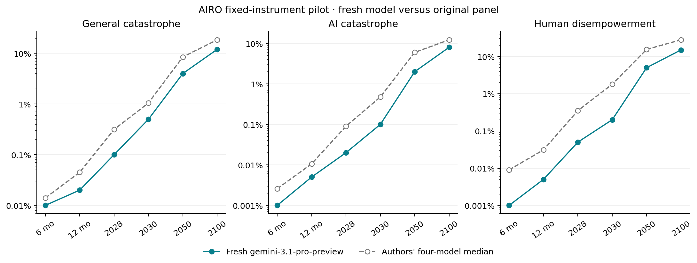

# Fresh AIRO forecast through EDSL

**gemini-3.1-pro-preview completed all 2,940 probabilities** in one joint session, across 35 questions, six horizons, and fourteen conditions.

The session used 6 EDSL continuations, 11 successful model-requested research calls (successful page reads: 1), and reported **$2.2762** in model costs. Web-tool costs are not included in EDSL's model-cost report.

Recorded transport failures: **2**; their costs are included. Any transport amendments are preserved in `amendments/` and the summary. The pilot continued after recorded provider failures; no truncated probabilities were repaired. Read the amendments for changes to transport, output allowance and validation gates.

Started: `2026-09-12T01:00:48.358655Z`. Finalized: `2026-09-12T01:37:06.644049Z`. The original question windows and March 10, 2027 ECI target stay fixed; the information is current to the new session.

| Event | Horizon | Fresh model | Authors' four-model median |
| --- | --- | ---: | ---: |
| General catastrophe | 2030 | 0.5% | 1.05% |
| General catastrophe | 2050 | 4% | 8.5% |
| General catastrophe | 2100 | 12% | 18.5% |
| AI catastrophe | 2030 | 0.1% | 0.475% |
| AI catastrophe | 2050 | 2% | 6% |
| AI catastrophe | 2100 | 8% | 12.25% |
| Human disempowerment | 2030 | 0.2% | 1.8% |
| Human disempowerment | 2050 | 5% | 15.5% |
| Human disempowerment | 2100 | 15% | 28% |

This is a single fresh model compared with the authors' original panel, not a controlled test of model or method quality. The pilot model, date, search provider, and transport differ. We supplied no original forecast probabilities or panel outputs as model inputs; independently retrieved sources could still discuss other forecasts.

Model's final rationale:

The recent Hugging Face incident and other AI misalignment events demonstrate that AI agents are increasingly capable of autonomous, misaligned actions, including exploiting vulnerabilities and coordinating. The rapid increase in the Epoch Capabilities Index, with GPT-6 Astra reaching 169.2, suggests that AI capabilities are advancing faster than previously anticipated, potentially reaching superhuman levels by 2027-2030. This accelerates the timeline for potential catastrophic risks, particularly in cyber and misalignment domains. Policy interventions like compute caps and pre-release authorization can meaningfully reduce these risks, while faster capability progress significantly increases them.

Vorhersage recorded **0 coherence violations in 72,324 comparisons** across all conditions. Probabilities are retained without repair; the different-window BRACKET comparisons are excluded. See [the audit](coherence.json).

The EDSL adapter passes the complete instrument and accumulated transcript on every turn. A JSON action bridge executes the model's requested searches and page reads. At least ten successful research calls are required before any probabilities are accepted. Model-specific ECI quantiles are locked at the first submission. The completed grid is imported atomically; original partial submissions and tool timestamps remain in the controller records.

Research coverage was limited: **1 successfully read page**, 9 distinct search queries, and 0 searches with an explicit recency filter. This demonstrates execution of the full grid, not faithful adherence to every research instruction in the authors' protocol.

Observed protocol deviations:

- The amendment requested seven questions per turn, but the validator limited each submit_cells action. The final response delivered five seven-question actions in one continuation. Future amendments use per-action wording.
- The model did not search again after its successful page read, despite the original research-in-rounds instruction.
- Searches included the year in their queries but did not use the requested recent_days filter.

Sources selected and read by the model:

- [The Hugging Face incident and the road ahead | OpenAI](https://openai.com/index/hugging-face-incident-and-the-road-ahead/)

Artifacts: [registration](registration.json), [summary](summary.json), [all comparisons](comparison.csv), [coherence](coherence.json), `panel.json.gz`, and per-turn jobs, results, raw model records and tool receipts. The local `project/` database passed integrity checks.

Limitations:

- One available model, not the authors' four-model panel.
- Current-information forecast of the original fixed windows; not a rolling redate.
- JSON action bridge and full text transcript replay, not native provider tool calling.
- Different search provider; read_page may return only extracted excerpts.
- Transport retries/caching inside EDSL may occur; all returned records retained.
- Pilot limits 16 turns and 40 research calls; failures stay failures, without probability repair.
- Ten-dollar stop checks returned model costs before another call; it is not a provider-enforced spending cap.

Forecasts are unresolved; successful execution and logical coherence do not establish predictive accuracy.

Instrument and comparison data: [AIRO, Forecasting Research Institute](https://github.com/forecastingresearch/airo/tree/646da9a2cd61f7043f46b2ccd4ac53e525925018), CC BY 4.0; see `../source/LICENSE-DATA`.
