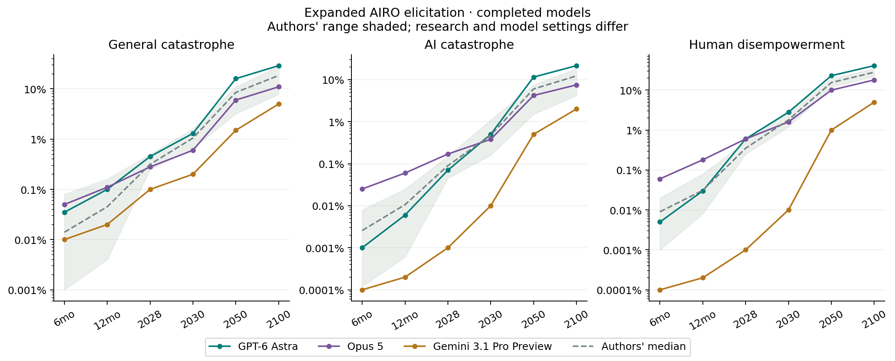

# Expanded AIRO model study

[Interactive comparison](comparison.html) · [Full CSV](comparison.csv) · [Replication protocol and gaps](../REPLICATION.md)

All attempted models are reported. Failed or unfinished sessions have no final probability estimates in the comparison.

| Model | Outcome | Questions accepted | Successful tools | Distinct pages | Failed tools | Reported model cost |
| --- | --- | ---: | ---: | ---: | ---: | ---: |
| GPT-6 Astra | complete | 35 | 21 | 9 | 1 | $8.45982 |
| Opus 5 | complete | 35 | 17 | 7 | 1 | $5.57210 |
| Fable 5.1 | refused | 0 | 18 | 6 | 0 | $3.17417 |
| Gemini 3.1 Pro Preview | complete | 35 | 16 | 6 | 2 | $2.10398 |

Total reported model cost: **$19.31007**, including failed calls; web costs are not included.

The research provider was web.run, not the authors' Tavily. Expanded gates enforce recency, multiple distinct sources and later-turn follow-up searches. Page windows preserve the available provider extraction; that extraction can still be incomplete.

Astra requested xhigh, but the local EDSL adapter drops the setting. Its effective remote effort is unverified. Opus required lowering adaptive effort from max to high after using all 20,000 tokens on thinking. Both Anthropic models required lowering the initial 64,000-token allowance because the EDSL adapter lacks streaming. Fable subsequently returned a provider refusal and its session ended. All changes and costs are recorded.

## Headline forecasts by 2050

| Model | General catastrophe | AI catastrophe | Disempowerment |
| --- | ---: | ---: | ---: |
| GPT-6 Astra | 16% | 11.5% | 23% |
| Opus 5 | 6% | 4.2% | 10% |
| Fable 5.1 | — | — | — |
| Gemini 3.1 Pro Preview | 1.5% | 0.5% | 1% |
| Authors' four-model median | 8.5% | 6% | 15.5% |

Compare Astra and Opus with their respective original model as well as with the four-model median. Compare the new Gemini with its original pilot. These single live-research sessions change several factors at once and cannot identify the effect of research depth or EDSL transport. A controlled experiment needs repeated runs with frozen evidence and verified provider settings.

Instrument and original panel: AIRO, Forecasting Research Institute, CC BY 4.0 with third-party carve-outs; see ../source/LICENSE-DATA.
