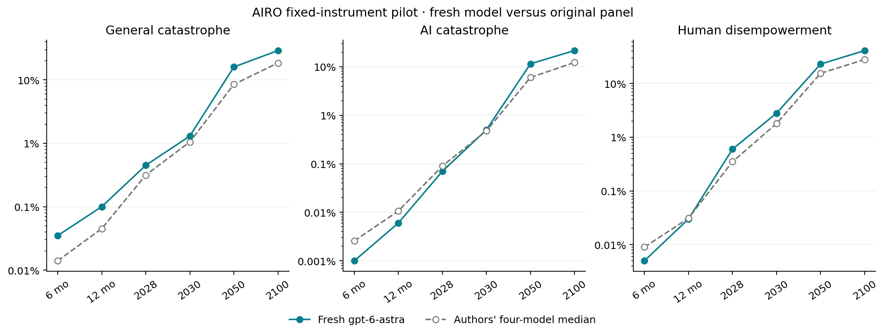

# Fresh AIRO forecast through EDSL

**gpt-6-astra completed all 2,940 probabilities** in one joint session, across 35 questions, six horizons, and fourteen conditions.

The session used 11 EDSL continuations, 21 successful model-requested research calls (successful page reads: 13), and reported **$8.4598** in model costs. Web-tool costs are not included in EDSL's model-cost report.

Recorded transport failures: **2**; their costs are included. Any transport amendments are preserved in `amendments/` and the summary. The pilot continued after recorded provider failures; no truncated probabilities were repaired. Read the amendments for changes to transport, output allowance and validation gates.

Started: `2026-09-12T11:22:30.404004Z`. Finalized: `2026-09-12T13:39:38.435761Z`. The original question windows and March 10, 2027 ECI target stay fixed; the information is current to the new session.

| Event | Horizon | Fresh model | Authors' four-model median |
| --- | --- | ---: | ---: |
| General catastrophe | 2030 | 1.3% | 1.05% |
| General catastrophe | 2050 | 16% | 8.5% |
| General catastrophe | 2100 | 29% | 18.5% |
| AI catastrophe | 2030 | 0.5% | 0.475% |
| AI catastrophe | 2050 | 11.5% | 6% |
| AI catastrophe | 2100 | 21.5% | 12.25% |
| Human disempowerment | 2030 | 2.8% | 1.8% |
| Human disempowerment | 2050 | 23% | 15.5% |
| Human disempowerment | 2100 | 41% | 28% |

This is a single fresh model compared with the authors' original panel, not a controlled test of model or method quality. The pilot model, date, search provider, and transport differ. We supplied no original forecast probabilities or panel outputs as model inputs; independently retrieved sources could still discuss other forecasts.

Model's final rationale:

This elicitation is dated September 12, 2026, while retaining all specified September 10 incident-onset intervals, absolute deadlines, three-year incident harm windows, separate catastrophe criteria, and the frozen ECI scale; all 35 questions have been delivered. Epoch's measured capability trend supports continued progress with substantial upside uncertainty, and its differently calibrated live scores were not substituted for the instrument's frozen scores. FBI loss data and Anthropic's September threat report support high probabilities of cumulative lower-threshold cyber damages, while biological bottlenecks and the distinction between benchmark performance and realized harm keep near-term epidemic probabilities substantially lower. OpenAI's Astra safety overview and Anthropic's alignment investigation indicate both stronger capabilities and meaningful safeguards, supporting nonzero loss-of-control tails without treating adversarial evaluations as observed catastrophes. The biological-risk elicitation, XPT disagreement and accuracy studies, and SIPRI's nuclear assessment informed uncertain long-run tails and non-AI catastrophe risk rather than supplying directly transferable probabilities. Policy scenarios hold the stipulated median capability trajectory fixed and represent judgmental intervention assumptions, not empirically established causal effects; capability scenarios incorporate associated deployment, defensive, and governance responses, and policy persistence beyond 2050 is not assumed.

Vorhersage recorded **0 coherence violations in 72,324 comparisons** across all conditions. Probabilities are retained without repair; the different-window BRACKET comparisons are excluded. See [the audit](coherence.json).

The EDSL adapter passes the complete instrument and accumulated transcript on every turn. A JSON action bridge executes the model's requested searches and page reads. At least ten successful research calls are required before any probabilities are accepted. Model-specific ECI quantiles are locked at the first submission. The completed grid is imported atomically; original partial submissions and tool timestamps remain in the controller records.

Recorded research coverage: **13 successful page-read windows**, 8 distinct search queries, and 4 searches with an explicit recency filter. Tool counts alone do not establish research quality or faithful adherence to every instruction in the authors' protocol.

Observed protocol deviations:

- None detected by these limited checks.

Sources selected and read by the model:

- [The ECI frontier has advanced by 14 points per year since the introduction of reasoning models | Epoch AI](https://epoch.ai/data-insights/eci-frontier-trend)
- [298@P11: $160 million in losses](https://www.fbi.gov/file-repository/2025_ic3report.pdf)
- [. Verified findings were routed in real time to a Telegram group organized into over 100 source types.](https://www.anthropic.com/threat-intelligence-report-september-2026)
- [An alignment assessment of recent cybersecurity incidents \ Anthropic](https://www.anthropic.com/research/alignment-assessment-cybersecurity-incidents)
- [ty scenarios where the risk of harm emerges from the broader context rather than an explicit request.](https://openai.com/index/safety-overview-gpt-6-astra/)
- [Forecasting LLM-enabled Biorisk and the Efficacy of Safeguards – Forecasting Research Institute](https://forecastingresearch.org/research/llm-enabled-biorisk)
- [Forecasting Existential Risks: Evidence from a Long-Run Forecasting Tournament – Forecasting Research Institute](https://forecastingresearch.org/research/existential-risk-persuasion-tournament)
- [tion. These aggregated predictions showed weak but positive evidence of outperforming the “no-change” forecast, though not trend extrapolation. This finding reinforces the well-est](https://forecastingresearch.org/research/near-term-xpt-accuracy)
- [Increasing focus on nuclear weapons amid heightened escalation risks—new SIPRI Yearbook out now | SIPRI](https://www.sipri.org/media/press-release/2026/increasing-focus-nuclear-weapons-amid-heightened-escalation-risks-new-sipri-yearbook-out-now)

Artifacts: [registration](registration.json), [summary](summary.json), [all comparisons](comparison.csv), [coherence](coherence.json), `panel.json.gz`, and per-turn jobs, results, raw model records and tool receipts. The local `project/` database passed integrity checks.

Limitations:

- One separately elicited model session; panel aggregation is a separate operation.
- Current-information forecast of the original fixed windows; not a rolling redate.
- JSON action bridge and full text transcript replay, not native provider tool calling.
- Page extraction can omit content; read windows and failed requests are recorded.
- Transport retries/caching inside EDSL may occur; all returned records retained.
- Controller limits are recorded in registration; failures stay failures, without probability repair.
- The cost stop checks returned model costs before another call; it is not a provider-enforced spending cap.
- Expanded research minimums are additional constraints, not the authors' literal tool gate.
- The authors used Tavily; this session uses a different research provider.

Forecasts are unresolved; successful execution and logical coherence do not establish predictive accuracy.

Instrument and comparison data: [AIRO, Forecasting Research Institute](https://github.com/forecastingresearch/airo/tree/646da9a2cd61f7043f46b2ccd4ac53e525925018), CC BY 4.0; see `../../source/LICENSE-DATA`.
