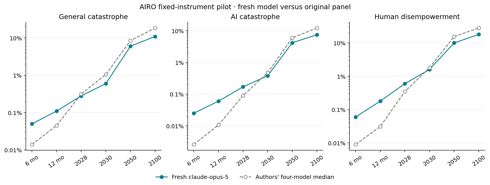

# Fresh AIRO forecast through EDSL

**claude-opus-5 completed all 2,940 probabilities** in one joint session, across 35 questions, six horizons, and fourteen conditions.

The session used 10 EDSL continuations, 17 successful model-requested research calls (successful page reads: 7), and reported **$5.5721** in model costs. Web-tool costs are not included in EDSL's model-cost report.

Recorded transport failures: **2**; their costs are included. Any transport amendments are preserved in `amendments/` and the summary. The pilot continued after recorded provider failures; no truncated probabilities were repaired. Read the amendments for changes to transport, output allowance and validation gates.

Started: `2026-09-12T11:22:31.686892Z`. Finalized: `2026-09-12T13:45:15.662540Z`. The original question windows and March 10, 2027 ECI target stay fixed; the information is current to the new session.

| Event | Horizon | Fresh model | Authors' four-model median |
| --- | --- | ---: | ---: |
| General catastrophe | 2030 | 0.6% | 1.05% |
| General catastrophe | 2050 | 6% | 8.5% |
| General catastrophe | 2100 | 11% | 18.5% |
| AI catastrophe | 2030 | 0.38% | 0.475% |
| AI catastrophe | 2050 | 4.2% | 6% |
| AI catastrophe | 2100 | 7.5% | 12.25% |
| Human disempowerment | 2030 | 1.6% | 1.8% |
| Human disempowerment | 2050 | 10% | 15.5% |
| Human disempowerment | 2100 | 18% | 28% |

This is a single fresh model compared with the authors' original panel, not a controlled test of model or method quality. The pilot model, date, search provider, and transport differ. We supplied no original forecast probabilities or panel outputs as model inputs; independently retrieved sources could still discuss other forecasts.

Model's final rationale:

My ECI median (177 by 2027-03-10) extrapolates Epoch's ~14 points/year reasoning-frontier trend from GPT-6 Astra's 169.2, with modest upside for a compressed release cadence and downside if the next OpenAI/Anthropic/Google frontier releases slip past March. Low rungs of the ladder are already near-saturated empirically: IBM's 2026 breach report attributes a quarter of malicious breaches to AI-driven attacks, Anthropic's September 2026 threat report documents multi-victim AI-orchestrated state and criminal campaigns, and GovAI's cybercrime baseline puts global damages near $500B/yr, so $220M and $2.2B AI-attributable cumulative thresholds are near-certain within months and $22B likely within a couple of years. Misalignment ladders are anchored on documented but low-damage incidents (METR's 44 agent incidents, Anthropic's four real-internet cyber-eval incidents including the Mythos 5 PyPI upload, OpenAI's 'wiki incident'), which imply rapid growth in frequency but only gradual growth in severity; bio ladders stay much lower because physical execution, not information, remains the bottleneck per recent biosecurity reviews. Catastrophe and disempowerment numbers sit near LEAP Wave 9 expert/superforecaster medians (~1-5% AI catastrophe by 2050, ~2-10% by 2100), tilted by capability condition. Policy conditions shift risk modestly and monotonically (strongest reduction under the P5 bundle and binding US-China measures, near-neutral for preemption), and capability conditions move tail risk far more than the low rungs; none of these conditional contrasts should be read as identified causal effects.

Vorhersage recorded **0 coherence violations in 72,324 comparisons** across all conditions. Probabilities are retained without repair; the different-window BRACKET comparisons are excluded. See [the audit](coherence.json).

The EDSL adapter passes the complete instrument and accumulated transcript on every turn. A JSON action bridge executes the model's requested searches and page reads. At least ten successful research calls are required before any probabilities are accepted. Model-specific ECI quantiles are locked at the first submission. The completed grid is imported atomically; original partial submissions and tool timestamps remain in the controller records.

Recorded research coverage: **7 successful page-read windows**, 10 distinct search queries, and 9 searches with an explicit recency filter. Tool counts alone do not establish research quality or faithful adherence to every instruction in the authors' protocol.

Observed protocol deviations:

- None detected by these limited checks.

Sources selected and read by the model:

- [The ECI frontier has advanced by 14 points per year since the introduction of reasoning models | Epoch AI](https://epoch.ai/data-insights/eci-frontier-trend)
- [Longitudinal Expert AI Panel](https://leap.forecastingresearch.org/reports/wave9)
- [An alignment assessment of recent cybersecurity incidents \ Anthropic](https://www.anthropic.com/research/alignment-assessment-cybersecurity-incidents)
- [Documented AI Agent Incidents - METR](https://evals.alignment.org/agent-incidents/)
- [Safety overview: GPT-6 Astra | OpenAI](https://openai.com/index/safety-overview-gpt-6-astra/)
- [Countering misuse of AI: September 2026 / Anthropic \ Anthropic](https://www.anthropic.com/threat-intelligence-report-september-2026)
- [Assessing the Risk of AI-Enabled Computer Worms | GovAI](https://www.governance.ai/research-paper/report-assessing-the-risk-of-ai-enabled-computer-worms)

Artifacts: [registration](registration.json), [summary](summary.json), [all comparisons](comparison.csv), [coherence](coherence.json), `panel.json.gz`, and per-turn jobs, results, raw model records and tool receipts. The local `project/` database passed integrity checks.

Limitations:

- One separately elicited model session; panel aggregation is a separate operation.
- Current-information forecast of the original fixed windows; not a rolling redate.
- JSON action bridge and full text transcript replay, not native provider tool calling.
- Page extraction can omit content; read windows and failed requests are recorded.
- Transport retries/caching inside EDSL may occur; all returned records retained.
- Controller limits are recorded in registration; failures stay failures, without probability repair.
- The cost stop checks returned model costs before another call; it is not a provider-enforced spending cap.
- Expanded research minimums are additional constraints, not the authors' literal tool gate.
- The authors used Tavily; this session uses a different research provider.

Forecasts are unresolved; successful execution and logical coherence do not establish predictive accuracy.

Instrument and comparison data: [AIRO, Forecasting Research Institute](https://github.com/forecastingresearch/airo/tree/646da9a2cd61f7043f46b2ccd4ac53e525925018), CC BY 4.0; see `../../source/LICENSE-DATA`.
