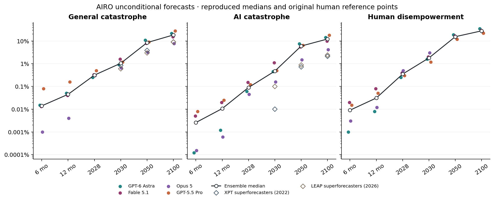
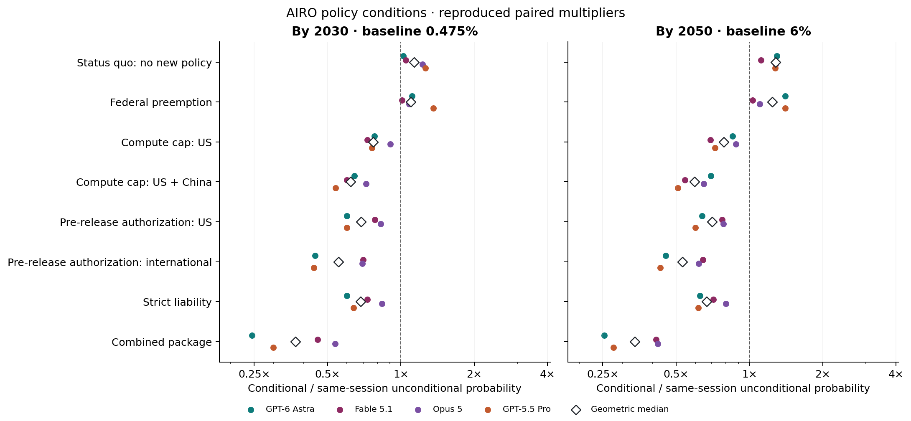
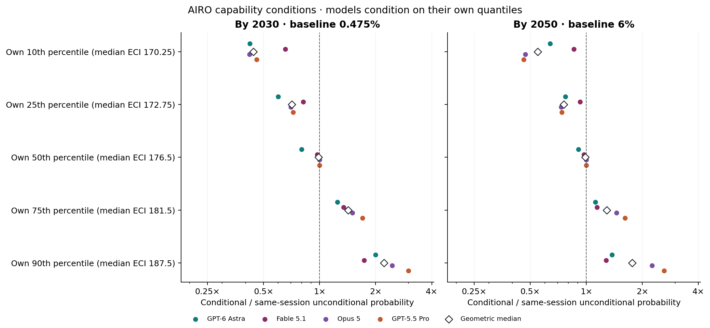
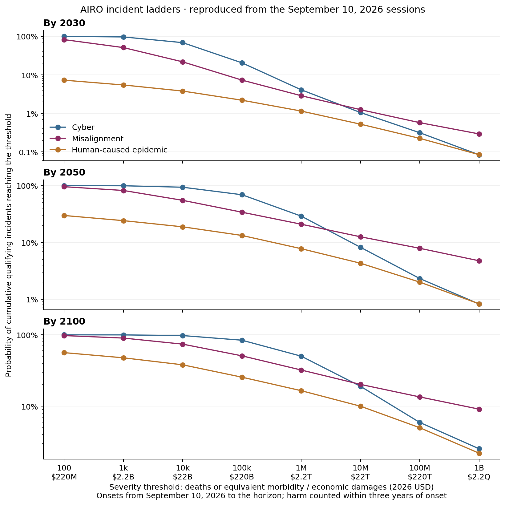

# Reproducing the authors' AIRO panel

Imported **11,760 probabilities** from the authors' four original sessions and recomputed the panel summaries using Vorhersage's joint-session aggregation functions. All **376 published-value checks passed**. No new forecasts or paid model calls were made.

Source: [Forecasting Research Institute's AIRO repository](https://github.com/forecastingresearch/airo/tree/646da9a2cd61f7043f46b2ccd4ac53e525925018), run `2026-09-10T2141Z`, protocol `unified-joint-combined-v5`. Original source rows and instrument files are frozen with hashes under `../source/`.

| Forecast | By 2030 | By 2050 | By 2100 |
| --- | ---: | ---: | ---: |
| General catastrophe | 1.05% | 8.5% | 18.5% |
| AI catastrophe | 0.475% | 6% | 12.25% |
| Human disempowerment | 1.8% | 15.5% | 28% |

Values retain source precision. The paper reports rounded values, including 0.47% for the raw 0.475% AI-catastrophe median in 2030.

| Policy condition | 2030 multiplier | 2050 multiplier | 2050 vs. status quo |
| --- | ---: | ---: | ---: |
| Status quo: no new policy | 1.132× | 1.278× | 1.000× |
| Federal preemption | 1.096× | 1.241× | 1.001× |
| Compute cap: US | 0.769× | 0.786× | 0.641× |
| Compute cap: US + China | 0.622× | 0.594× | 0.498× |
| Pre-release authorization: US | 0.685× | 0.702× | 0.549× |
| Pre-release authorization: international | 0.555× | 0.530× | 0.412× |
| Strict liability | 0.682× | 0.667× | 0.550× |
| Combined package | 0.369× | 0.339× | 0.267× |

The first two columns reproduce the paper's geometric medians of within-model ratios. The last column is an additional comparison: each policy versus the same model's status-quo condition. All policy conditions, including status quo, fix capability at that model's median trajectory; the unconditional baseline does not fix capability. These are model-elicited comparisons, not empirically identified policy effects.

The median own-90th-percentile capability condition raises the 2030 AI-catastrophe forecast by **2.214×**. Each model uses its own numeric capability estimate; these are not common ECI scenarios across the panel.

The authors' unconditional coherence diagnostic is reproduced: **0 violations in 1,996 comparisons**. Its 24 BRACKET comparisons link a catastrophe's mortality window to an incident ladder with a later onset start and a three-year harm window. Those are retained in the reproduction but excluded from Vorhersage's registered logical implications. The package separately checks the valid registered relations and their transitive implications under every condition.

That broader check finds **four conditional inconsistencies, all in Opus 5**. Each concerns a 12-month cyber incident at the 1,000-death-equivalent or $2.2 billion threshold exceeding the probability of any AI incident at the same threshold. This is additional analysis; the paper's 100% result is explicitly unconditional.

| Condition | Cyber incident | Any AI incident |
| --- | ---: | ---: |
| Compute cap: US + China | 79.7% | 78.4% |
| Pre-release authorization: US | 79.7% | 79% |
| Pre-release authorization: international | 79.5% | 76.4% |
| Combined package | 79.2% | 73% |

The incident categories overlap and their probabilities must not be summed. Deaths-or-damages incident thresholds do not decompose the deaths-only catastrophe question.

| Original model session | Finalization (UTC) | Searches | Page reads | Source-reported model cost |
| --- | --- | ---: | ---: | ---: |
| GPT-6 Astra | 2026-09-10T21:50:15+00:00 | 8 | 6 | $3.82 |
| Opus 5 | 2026-09-10T22:13:10+00:00 | 21 | 7 | $21.95 |
| Fable 5.1 | 2026-09-10T22:15:44+00:00 | 19 | 10 | $45.26 |
| GPT-5.5 Pro | 2026-09-10T23:02:06+00:00 | 24 | 16 | $36.84 |

The original sessions report $107.87 in model costs; these are historical charges, not costs incurred by this reproduction. Shared usage is counted once per session. Tool responses and source text are preserved as authors' records, without re-fetching or endorsing their claims. Per-tool timestamps and the original incremental probability submissions are absent from the expanded final export. Imported evidence times therefore use the session completion as an explicitly labeled upper bound.

Reproduced here: the complete principal probability grid and Figures 6–9, including all 210 unconditional medians and the saved endpoint conditional summaries. The ForecastBench calibration, simulator validation, anchoring experiments, and additional Figure 10 instruments remain separate reproduction tasks; this report does not establish forecasting accuracy.

Audit files: [verification](verification.json), [summary](summary.json), [all panel cells](panel.csv), [author coherence](author-coherence.json). Full panel/member reports are in `panel.json.gz` and `status-quo-comparison.json.gz`; the local Vorhersage project is in `project/`. Each figure is also available as a PDF in `figures/`.

Data and original definitions: AIRO, Forecasting Research Institute, https://airo.forecastingresearch.org, CC BY 4.0; see the preserved source licenses. This report and the reconstructed figures were generated by the Vorhersage reproduction scripts.
