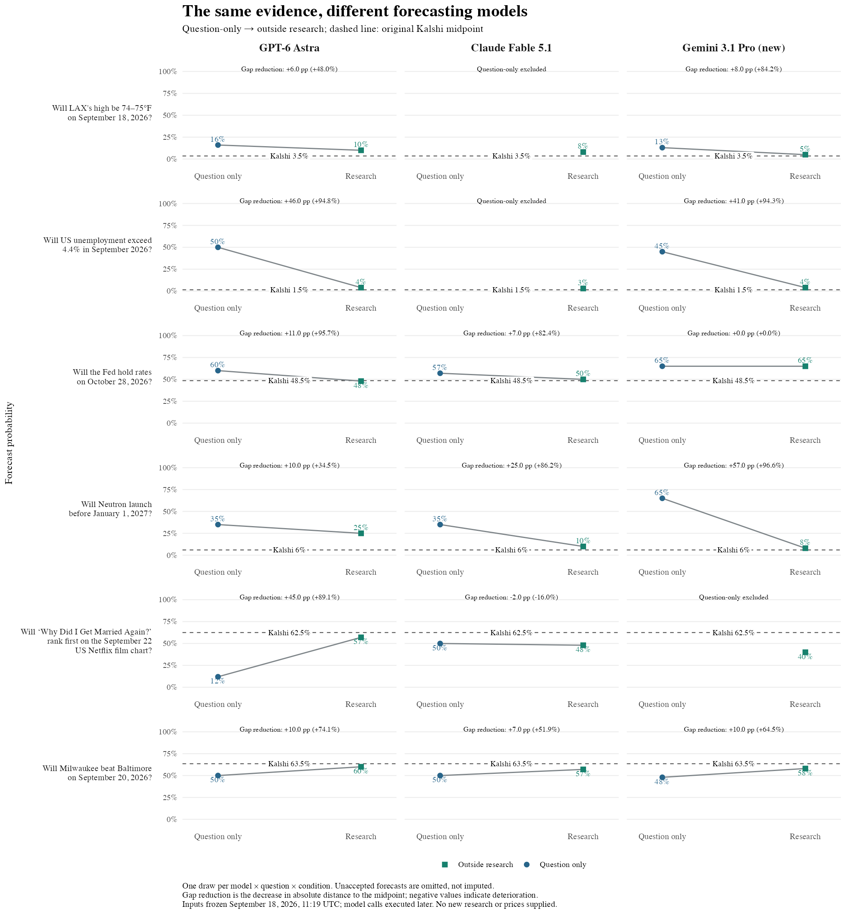

# Fixed-data model comparison

**36 new model calls completed for $1.41367 in reported response costs.**
The six questions, evidence packets, agent instruction, and 12 forecast prompts
are unchanged from the [original study](../kalshi_blind_20260918/README.md).
Every returned system/user prompt exactly matches its original counterpart.
No new research, tools, prices, or previous forecasts were supplied to the models.

All 18 research-condition forecasts passed validation. On the **same six contracts**:

| Model | Mean absolute distance from Kalshi | RMSE | All-call cost |
| --- | ---: | ---: | ---: |
| Claude Fable 5.1 | 5.42 pp | 6.99 pp | $0.84760 |
| GPT-6 Astra | 6.25 pp | 8.68 pp | $0.39430 |
| Gemini 3.1 Pro, new run | 8.42 pp | 11.70 pp | $0.17177 |
| Gemini 3.1 Pro, original run | 8.58 pp | 11.40 pp | $0.16835 |

Costs cover both conditions and include rejected responses. The original run's
cost is separate from the $1.41367 new expenditure. Provider job totals round
slightly differently. Research collection and coordinator time are not included.
Excluding same-day weather, research MAE is 5.60 pp for Claude, 6.20 pp for Astra,
and 9.80 pp for Gemini on the same five remaining contracts.



[Vector figure](figures/performance.pdf) · [Short report](report.pdf) ·
[Machine-readable comparison](run/comparison.json)

Each row is a question and each column a model. The dashed line is the **original
opening Kalshi midpoint**, not a later market quote. Slopes connect independently
elicited question-only and research forecasts. Labels give absolute and relative
reductions in distance from that midpoint. Missing points are excluded responses;
they are not zeros. The Netflix estimate worsens slightly for Claude; the Fed
estimate does not change for Gemini. Effects differ by question and model.

## Matched before/after comparison

Three question-only responses triggered the unchanged excluded-content rule:
Claude on weather and employment, and Gemini on Netflix. All three infer facts
from contract selection or strike placement despite the original instruction
that contract definitions are not likelihood evidence. Claude's employment
response also explicitly says it did not use prediction-market odds; that
disclaimer triggers the same conservative text rule. A mention is not proof of
price exposure, and no returned response demonstrates access to the evaluator's
prices. The exclusions remain in the primary analysis; no outputs were edited.

Consequently, the **fully matched two-condition cohort** contains only Fed,
Neutron, and baseball. Comparisons of research forecasts above retain all six
because every model returned an accepted research forecast on every question.

| Model | Question-only MAE | Research MAE | Gap reduction |
| --- | ---: | ---: | ---: |
| GPT-6 Astra | 18.00 pp | 7.67 pp | 10.33 pp (57.4%) |
| Claude Fable 5.1 | 17.00 pp | 4.00 pp | 13.00 pp (76.5%) |
| Gemini 3.1 Pro, new run | 30.33 pp | 8.00 pp | 22.33 pp (73.6%) |

Acceptance was 12/12, 10/12, and 11/12 respectively. Available-case means are
also saved, but should not be compared as though they covered identical cohorts.
The prespecified sensitivity excluding same-day weather leaves the fully matched
cohort unchanged because weather was already excluded from that cohort.

## Design and interpretation

This is a later **fixed-data model comparison**. Registration occurred after the
coordinator had seen the original results and target prices. The new calls used
independent contexts with the original prompts; this preserves input blinding
for the workers, not coordinator blinding. The frozen information cutoff is
September 18, 2026, 11:19:02 UTC; the new execution occurred September 19 UTC
(September 18 Eastern time). Runs are correctly marked `retrospective` and are
not backdated. In particular, the original same-day weather event may have
become known by this later execution; no live outcome-status claim is made.

Market probabilities are useful intermediate benchmarks: they provide timely,
information-rich targets without waiting for settlement. The original future-event
design avoids leakage of realized future outcomes. This follow-up holds the
original information set fixed, with no subsequent outcome or market retrieval.
As in the original report, agreement with market beliefs and eventual calibration
answer related but different questions. The small convenience sample and one
draw per cell support descriptive comparisons, not a general model ranking.

There are six first-class arms: three models crossed with two data conditions.
All share the same direct-judgment method and assessment/issuance stages.
The Gemini replication retains the original 2,048-token thinking budget and
temperature 0.5. Astra uses high reasoning effort; Claude uses adaptive thinking
with high effort. Each has an 8,192-token output ceiling. These provider-specific
settings are recorded, not treated as equivalent computation budgets.

Model choices were checked against the service catalog and official documentation:
[OpenAI](https://developers.openai.com/api/docs/models/gpt-6-astra),
[Anthropic](https://platform.claude.com/docs/en/models/overview), and
[Google](https://ai.google.dev/gemini-api/docs/models).
EDSL serializations include some legacy default parameters that provider adapters
may omit. Raw returned model IDs are verified; the exact server-side request
parameter transformation is not independently attested.

The original Netflix packet's incomplete release context is deliberately
unchanged. Improving that packet would be a different data arm, not a clean model
comparison. Gemini again mistakes the title for an older film in its question-only
response. These are useful candidates for a future, separately registered test.

## Audit and reproduction

- [Registration](run/registration.json): models, six arms, cohort rules, budget,
  actual registration time, and original input hashes.
- [Transport manifest](run/transport.json): prompt/task hashes and jobs hashes.
- [Audit](run/audit.json): all 36 complete system/user prompt receipts match the
  original run and all raw returned model IDs match their registered models.
- `run/{astra,fable,gemini}`: jobs, submissions, provider status, raw results,
  attempts, costs, immutable forecast exports, and seal commitments.
- [Import correction](run/import-correction.json): the first importer rejected
  all responses because EDSL adds two serialization metadata fields to scenarios.
  The corrected validator requires exactly those fields and unchanged substantive
  inputs. Initial rejection records remain under `import-v1-metadata-mismatch`.
  This correction changed neither forecast content nor inference; there were no
  additional model calls or forecast repairs.
- Initial sandbox connectivity failures for Claude/Gemini occurred before remote
  job creation and are preserved separately. All three submitted jobs report 12
  completed interviews and zero interviews with exceptions.

From the repository root, inspect the checked-in run without inference:

```bash
.venv/bin/python examples/kalshi_models_20260918/compare.py verify
.venv/bin/python examples/kalshi_models_20260918/compare.py audit
.venv/bin/python examples/kalshi_models_20260918/compare.py score
Rscript examples/kalshi_models_20260918/plot_performance.R
```

The archived example requires EDSL for preparing/importing calls and ggplot2 plus
jsonlite for plotting. The core package gains no dependencies. `prepare` refuses
to overwrite an existing registration. To make a new experiment, use a separate
run directory and distinct versioned registration; do not overwrite this history.
Calls use Expected Parrot with `--fresh`, no tools, and private result visibility.
