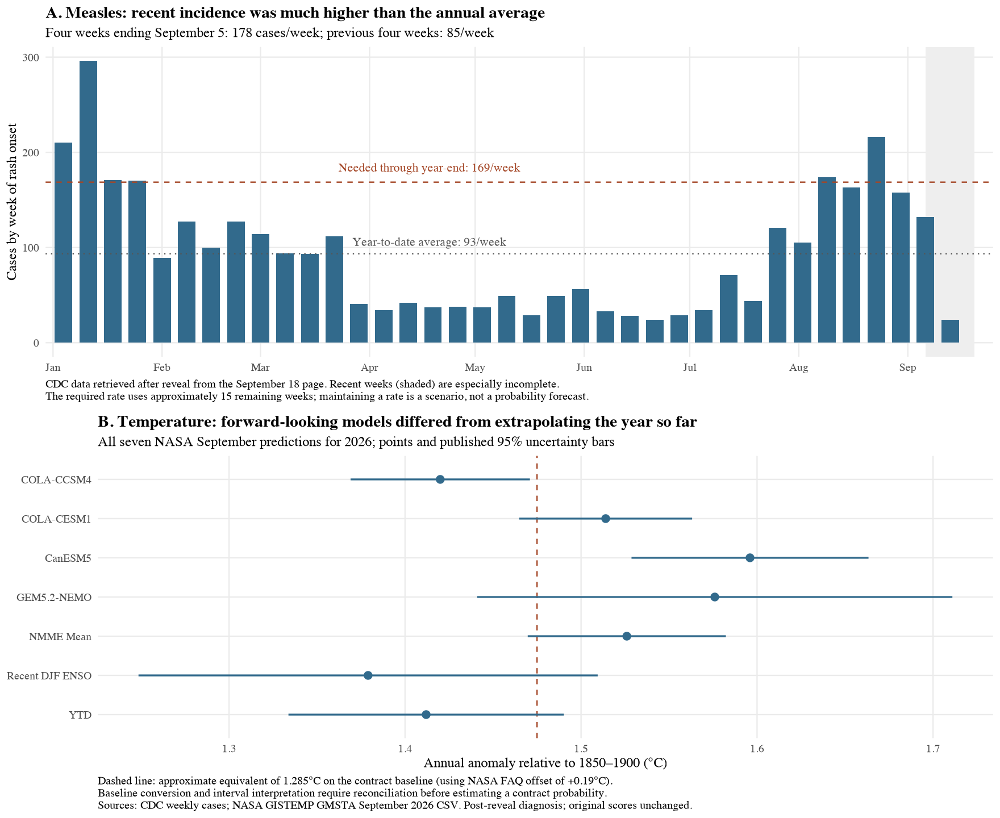

# Postmortem: why the measles and temperature forecasts were so low

September 18, 2026 (New York); September 19 UTC. **Post-reveal diagnosis**, following the registered seven-contract experiment. This analysis preserves the original forecasts, targets, packets, and scores.

The strongest explanation is an evidence-selection failure: we supplied cumulative observations without the most relevant recent trajectory or forward-looking outlook. Models then substituted general background assumptions for missing current information. Their own stated uncertainties often identified the next useful search, but the experimental method prohibited tools and follow-up. A separate settlement interpretation error pushed some measles forecasts down further.

This is more specific than a general tendency for LLM probabilities to be too low. It points first to improving research selection and acting on consequential missing information, before learning a universal probability correction.

## What needs explaining

Mean research forecasts across three fresh calls per model:

| Contract | Astra | Claude | Gemini | Sealed midpoint |
|---|---:|---:|---:|---:|
| More than 6,000 U.S. measles cases in 2026 | 24.3% | 6.7% | 13.0% | 61.0% |
| 2026 NASA annual temperature index above 1.28°C and 2025 | 32.3% | 31.7% | 11.3% | 74.6% |

The original bid–ask intervals were 59–63% and 74.3–74.9%, respectively. These disagreements are much larger than the spreads. Market midpoints are the useful intermediate benchmark chosen for this study; we investigate departures from that benchmark without needing realized outcomes.

These two questions explain why every research model lost to constant 50% on this batch. Decomposing the **original seven-question MAE**, without deleting questions:

| Contribution to research MAE minus constant-50 MAE | Astra | Claude | Gemini |
|---|---:|---:|---:|
| Measles and temperature | +6.19 pp | +8.81 pp | +10.81 pp |
| Other five questions | −3.24 pp | −5.14 pp | −3.05 pp |
| Total disadvantage | +2.95 pp | +3.67 pp | +7.76 pp |

Each cell is divided by all seven questions. Positive means worse than the control. This is an error decomposition, not a proposed exclusion rule. Research did not uniformly worsen these two questions either: it raised Astra's forecasts on both, lowered Claude's measles forecast, and lowered Gemini's temperature forecast.

## 1. Measles: the wrong rate became the anchor

The frozen packet reported 3,471 cases through September 17, 39 outbreaks during 2026, and a 95% outbreak-associated share. It contained no weekly series. The actual prompts included the selected claim and values, not the full captured CDC page.

The arithmetic was broadly correct: exceeding 6,000 requires another **2,530 cases**, approximately **169 per week** over the remaining 15 calendar weeks. The year-to-date average was about **93 per week**. But comparison with that annual average does not establish how demanding the hurdle is *now*.

The [CDC chart's underlying data](https://www.cdc.gov/wcms/vizdata/measles/MeaslesCasesWeekly.json), retrieved for this audit, show:

| Four-week rash-onset window | Cases per week |
|---|---:|
| July 12–August 8 | 85.25 |
| August 9–September 5 | 177.75 |

The newer window was already slightly above the required pace. Holding 177.75/week constant for 15 weeks gives approximately **6,137 cases**. That is an illustrative trajectory, not a fitted probability forecast. The window was selected after reveal, and recent onset counts are provisional and affected by reporting delay. The downloaded 2026 weeks sum to exactly the packet's 3,471 cases. The source labels the data through September 17; the underlying chart file was not frozen before the original forecasts.

This directly challenges Claude repetition 3's assumption that recent incidence was probably well below the annual average. Other rationales appealed to weaker autumn transmission without establishing the current outbreak trajectory. The [CDC page](https://www.cdc.gov/measles/data-research/index.html) cautions against a simple seasonal characterization and distinguishes cumulative outbreaks from currently active outbreaks. Claude twice described the 39 outbreaks as active; that is another unsupported interpretation, although its direction does not explain the low forecast.

There is also a confirmed contract-reading problem. Claude repetition 2 assumed the relevant count would likely be fixed around January 1, penalizing late-December reporting delays. The [already-frozen full terms](../definitions/measles-terms.pdf) distinguish last trading from expiration: expiration can follow release of full-year data, with a later backstop. Revisions are excluded **after expiration**, not automatically after the trading close. Our [definition supplement](../run/definition-notes.json) supplied the revision rule while omitting the expiration provisions needed to interpret it. The coordinator therefore shares responsibility for this error. Its numerical effect cannot be recovered from these responses alone.

**Diagnosis:** a missing recent incidence series materially changes the rate comparison; an invented current-rate assumption and an unwarranted settlement penalty made some forecasts especially low. We have not established the exact probability that a complete epidemic forecast would assign.

## 2. Temperature: a decisive current condition was left as a hypothetical

The packet supplied January–August anomalies totaling 9.79°C, averaging 1.22375°C. Using the rounded monthly values, the remaining four months must average above **1.3925°C** to exceed an unrounded annual 1.28°C. A reported annual value rounding to 1.29°C requires roughly **1.4075°C** over those months. August was already 1.40°C. Revisions and underlying precision matter at that boundary.

The models largely did this calculation correctly. The problem was deciding how likely continued warmth was. Gemini's 4% response called the threshold almost mathematically unreachable under ordinary variation, without estimating that variation. Four remaining months averaging 1.41°C would yield about 1.2858°C for the year. The hurdle is a forecasting question, not an arithmetic impossibility.

The [September 10 NOAA ENSO discussion](https://www.cpc.ncep.noaa.gov/products/analysis_monitoring/enso_advisory/ensodisc.shtml) already described strengthening El Niño conditions and placed the chance of a very strong fall/winter event above 90%. Multiple recorded rationales explicitly said strong El Niño could make their probabilities too low, while stating that its current status was unknown. The omitted information answered a question the models themselves considered consequential. ENSO probabilities cannot simply be substituted for the contract probability: temperature response, timing, and uncertainty still require a model.

There was an additional missed research lead. Our **pre-inference** [search receipt](../run/research/other-search.json) surfaced NASA's new [annual-temperature prediction page](https://data.giss.nasa.gov/gistemp/gmsta/). We did not follow it into the evidence packet. Its [September CSV](https://data.giss.nasa.gov/gistemp/gmsta/data/Annual_GISTEMP_GMSTA_Predictions_202609.csv) gives both forward-looking climate-model forecasts and statistical extrapolations:

| NASA method | Predicted 2026 anomaly, 1850–1900 baseline | Approximate contract-baseline equivalent |
|---|---:|---:|
| COLA-CCSM4 | 1.420°C | 1.230°C |
| COLA-CESM1 | 1.514°C | 1.324°C |
| CanESM5 | 1.596°C | 1.406°C |
| GEM5.2-NEMO | 1.576°C | 1.386°C |
| NMME mean | 1.526°C | 1.336°C |
| Recent DJF ENSO | 1.379°C | 1.189°C |
| Year-to-date regression | 1.412°C | 1.222°C |

The last column subtracts **approximately 0.19°C**, following the [NASA FAQ](https://data.giss.nasa.gov/gistemp/faq/). That published approximation is dated January 2025; an operational forecaster must reconcile the current baseline and data vintage rather than assume exact equivalence. NASA also distinguishes prediction intervals from confidence intervals. We retain the published uncertainty values in the figure and CSV but do not convert them into a new contract probability.

The disagreement across these methods matters: three dynamical models and their ensemble mean lie above the approximate threshold, while the year-to-date extrapolation is below it. A richer packet would expose competing forecasts and the current physical driver. It would not simply tell the LLM to increase its answer or discard the colder projections.

**Diagnosis:** omitted forward-looking evidence is a strong explanation for the low direction of the forecasts. The exact proportion of the market gap it explains remains unmeasured.

## Evidence visualization



[Vector PDF](diagnosis.pdf). The plots describe primary-source data and published scientific forecasts, not revised agent predictions. All seven current-year NASA estimates are included; the 2027 estimate is excluded because it addresses another year.

## What this says about our system

The tested [method](../run/method.json) was deliberately minimal: assessment followed by issuance, one model call, zero searches, no tools, and a coordinator-selected frozen packet. This experiment therefore evaluates **judgment given a small packet**, not the package's full adaptive research and review capabilities.

Three failure points recur:

1. **Evidence acquisition and compression.** An authoritative cumulative total is insufficient for a threshold forecast. Raw captures preserved useful context that the selected prompt omitted; a relevant NASA forecasting source was discovered but never pursued.
2. **Missing information did not change the workflow.** Models identified weekly incidence and ENSO as high-value unknowns. The pipeline stored those limitations and issued a forecast anyway.
3. **Assumptions acquired more numerical confidence than their support justified.** Correct threshold arithmetic was followed by an unfitted probability judgment. Repetition and model diversity could not reliably compensate for shared omissions.

The small repeated-call variation is consistent with stable shared mistakes. It does not establish that each model would respond identically to corrected evidence. These two examples also cannot identify a general calibration function.

## Changes to test next

| Change | Why this diagnosis supports it | How to evaluate it |
|---|---|---|
| Supply recent trajectories alongside cumulative totals | Annual averages hid the current measles pace | Register a recent-window rule, retain complete series, flag reporting delay |
| Require a search for relevant official forecasts and leading indicators | ENSO and NASA annual predictions were missing | Log searches, source dates, failures, units, and all competing forecasts |
| Separate occurrence, trading close, data release, expiration, and revision cutoff | An omitted definition detail produced a settlement penalty | Structured contract extraction checked against full terms before forecasting |
| Make extensive agent-led research the default, configurable by research effort | Rationales already identified the needed observations | Compare research budgets and strategies with the same model and cost accounting |
| Require support for the numerical probability mapping | Correct hurdle calculations did not justify tail probabilities | Preserve scenarios/distributions and distinguish fitted estimates from judgment |

### Research effort: the intended default

The user's preference is for agents to gather substantial data and search extensively. The next design should therefore default to **high research effort**, with an explicit configuration such as `research.effort: low | medium | high`. This is a design recommendation, not an implemented API. Research effort is separate from a provider's model reasoning-effort setting.

Effort should determine the available search calls, source-reading budget, follow-up rounds, and time/cost limits. High effort should support broad discovery followed by deep investigation: retrieve underlying time series, inspect definitions, seek official forecasts, check conflicting evidence, and follow up on unknowns that could materially change the answer. Presets should resolve to concrete, recorded budgets with optional overrides. A long bibliography alone should not satisfy the policy; repeated sources and syndicated copies are not independent evidence.

The agent should preserve retrieval receipts, report inaccessible data, and record why it stopped. Reaching a budget with a consequential unresolved question should remain visible in the issued forecast. For these market comparisons, the prohibition on market probabilities and Kalshi research evidence remains in force at every effort level; contract definitions remain a separate input.

Keep the frozen-packet condition as a deliberately limited experimental baseline. Compare low and high research effort on fresh questions, holding the forecasting model fixed initially. A separate experiment can freeze the richer evidence to distinguish gains from evidence collection from gains in interpreting that evidence. This makes both predictive agreement and its additional research cost measurable.

A replay of these two questions with expanded evidence would be useful debugging. Its results must be labeled post-reveal: the investigator now knows the targets. The credible next performance comparison uses fresh contracts, sealed prices, and a research policy chosen before reveal.

## Audit trail and reproduction

The review inspected all **18 research responses** for these questions. [Extracted responses](forecast-excerpts.json) retain trial IDs and repetition numbers, making the claims above traceable to the original raw records and prompt files. [Arithmetic](arithmetic.json), [per-question scores](scores.csv), and [loss contributions](loss-contributions.csv) are computed independently from saved inputs.

New retrievals are in `research/`, with browser receipts, downloaded source bodies, and a [download manifest](research/download-manifest.json). They were retrieved after the comparison was revealed at **2026-09-19 02:06:51 UTC**. Source dates place the relevant releases before inference, but post-reveal downloads are not contemporaneously sealed historical snapshots. Search-index copies of earlier CDC updates support additional checks; the main numerical diagnosis uses the directly downloaded weekly chart, not those cached snippets. No new market evidence was used to construct the diagnosis.

Original inputs and research files have separate SHA-256 manifests. The source-comparison hash is `2aeb18d3bced63801ec3fd9c8e67e32992c796e77d5167f7775d5cdd8dfadd42`.

From the repository root:

```sh
.venv/bin/python examples/kalshi_repeated_20260918/postmortem/analyze.py
Rscript examples/kalshi_repeated_20260918/postmortem/plot_diagnosis.R
.venv/bin/python examples/kalshi_repeated_20260918/verify_results.py
```

The analysis performs no new model calls and rewrites only derived files in this postmortem directory. The existing report and experimental scores remain unchanged.
